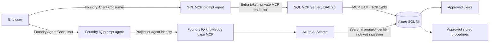

# Microsoft Foundry agents with Azure SQL Managed Instance

> [!NOTE]
> On branch `demo/public-evaluation`, the active implementation is a disposable public **SQL MCP-only** demonstration. Foundry IQ is out of scope. See [the demo roadmap](docs/demo-roadmap.md) and [operator guide](docs/demo-guide.md). The secure private architecture remains on `main`.

Portal-first reference implementation for connecting Microsoft Foundry agents to curated data in Azure SQL Managed Instance (SQL MI) through two controlled paths:

1. **SQL MCP Server**, built on Data API builder, for deterministic lookups, filters, aggregates, status checks, and stored-procedure reports.
2. **Foundry IQ**, backed by an indexed Azure SQL knowledge source in Azure AI Search, for semantic retrieval, synthesis, and citation-backed answers.

The design creates two comparable prompt agents instead of one agent that silently routes between both paths:

| Agent | Data path | Best fit |
|---|---|---|
| `transfer-agent-sql-mcp` | Foundry -> private SQL MCP Server -> SQL MI | Exact records, filters, counts, aggregates, and operational reports |
| `transfer-agent-foundry-iq` | Foundry -> knowledge base MCP endpoint -> Azure AI Search -> indexed SQL projection | Narrative questions, themes, synthesis, and citations |

Both agents use the same model, baseline instructions, and evaluation set. Their tool configuration is the controlled difference.

> [!IMPORTANT]
> This is a phased reference solution, not a completed production system. Phase 2 infrastructure has been deployed in part, but the SQL schema, database users and roles, SQL MCP container, prompt-agent versions, Azure SQL knowledge sources, and Foundry IQ knowledge base remain implementation work. As of July 13, 2026, the Central US Container Apps environment also requires an in-place retry after an Azure regional capacity failure. Do not present either data path as operational until the validation gates in this guide pass.

## Contents

- [Architecture](#architecture)
- [Security model](#security-model)
- [Reference deployment](#reference-deployment)
- [Portal deployment runbook](#portal-deployment-runbook)
- [Configure SQL authorization](#configure-sql-authorization)
- [Stand up SQL MCP Server](#stand-up-sql-mcp-server)
- [Connect the SQL MCP agent](#connect-the-sql-mcp-agent)
- [Stand up the Azure SQL knowledge source and Foundry IQ](#stand-up-the-azure-sql-knowledge-source-and-foundry-iq)
- [Assign human and workload access](#assign-human-and-workload-access)
- [Validate least privilege](#validate-least-privilege)
- [Operate and troubleshoot](#operate-and-troubleshoot)
- [Repository deployment path](#repository-deployment-path)
- [Microsoft references](#microsoft-references)

## Architecture



### Network layout

| Subnet | CIDR | Delegation or purpose |
|---|---:|---|
| `snet-foundry-agent` | `10.50.0.0/24` | Dedicated Foundry Agent Service network injection; delegated to `Microsoft.App/environments` |
| `snet-mcp` | `10.50.1.0/24` | Internal Container Apps environment for SQL MCP Server; delegated to `Microsoft.App/environments` |
| `snet-private-endpoints` | `10.50.2.0/24` | Private endpoints for Foundry, Search, Cosmos DB, Storage, and Azure Monitor |
| `snet-sqlmi` | `10.50.3.0/26` | Dedicated SQL MI subnet; delegated to `Microsoft.Sql/managedInstances` |

The SQL MCP workload and SQL MI are in the same VNet. MCP uses the SQL MI VNet-local FQDN on TCP `1433`; it does not need a SQL MI private endpoint in this topology. SQL MI's public endpoint remains disabled unless the explicitly documented Foundry IQ managed-identity profile is enabled.

Required private DNS zones:

| Service | Private DNS zone |
|---|---|
| Foundry | `privatelink.services.ai.azure.com` |
| Azure OpenAI data plane | `privatelink.openai.azure.com` |
| Azure AI Services | `privatelink.cognitiveservices.azure.com` |
| Azure AI Search | `privatelink.search.windows.net` |
| Cosmos DB for NoSQL | `privatelink.documents.azure.com` |
| Blob Storage | `privatelink.blob.core.windows.net` |
| Azure Monitor | `privatelink.monitor.azure.com` |
| Log Analytics ingestion | `privatelink.oms.opinsights.azure.com` and `privatelink.ods.opinsights.azure.com` |
| Agent automation | `privatelink.agentsvc.azure-automation.net` |

Link every zone to the VNet. If corporate DNS is authoritative, add conditional forwarders to Azure DNS at `168.63.129.16`. Portal and SDK users must enter through point-to-site VPN, site-to-site VPN, ExpressRoute, or a Bastion-hosted development VM because the Foundry data plane is private.

## Security model

Access is the intersection of three independent controls:

1. **Network reachability** decides whether the caller can reach Foundry, MCP, Search, or SQL MI.
2. **Microsoft Entra and Azure RBAC** decide whether a human or workload can use an Azure or Foundry resource.
3. **SQL and DAB authorization** decide which database objects and MCP operations the workload can use.

Passing one layer never bypasses another. `Foundry User`, `Contributor`, or `Owner` does not grant SQL access. A SQL contained user does not grant network access. DAB permissions cannot exceed the MCP identity's SQL grants.

### Workload identities

| Identity | Used for | Azure permissions | SQL permissions |
|---|---|---|---|
| Foundry project managed identity | Standard Agent Setup dependencies and development-time project connections | Narrow Storage, Cosmos DB, and Search roles | None |
| Shared project agent identity | Tool calls by unpublished agents when Agent Identity authentication is selected | Only downstream roles required by all development agents | None unless an approved tool requires it |
| Published agent identity | Tool calls by one published agent application | Reassign only that agent's downstream permissions | None in this design; it calls MCP or Search, not SQL directly |
| MCP user-assigned managed identity | Container image pull and outbound SQL authentication | `AcrPull` on the MCP registry; no broad Azure role | Membership in `mcp_reader` only |
| Search system-assigned managed identity | SQL ingestion and optional embedding/model calls for Foundry IQ | `Reader` on SQL MI; `Cognitive Services User` on the model-hosting Foundry account when required | Membership in `agent_reader` only |

The shared project agent identity is **not** the project's system-assigned managed identity. Foundry creates a separate Entra agent identity and blueprint when the first agent is created. The blueprint has a federated trust with the project managed identity, but the agent identity is the principal that needs downstream permissions when the MCP connection uses `AgenticIdentityToken`. A connection explicitly configured for `Project Managed Identity` instead uses the project managed identity. Inspect the project or published agent application's **JSON View** and grant access to the principal selected by the connection. See [Agent identity concepts](https://learn.microsoft.com/azure/foundry/agents/concepts/agent-identity).

### Human personas

Assign roles to Microsoft Entra security groups rather than individuals. Make elevated assignments eligible through Privileged Identity Management (PIM) where available.

| Persona | Minimum assignment | Scope | What it allows |
|---|---|---|---|
| Bootstrap platform administrator | `Contributor` plus `Role Based Access Control Administrator`, or temporary `Owner` | Target resource group; subscription only where provider registration or quota requires it | Create infrastructure and assign approved roles |
| Foundry account/model administrator | `Foundry Account Owner` | Foundry resource; use subscription scope only for initial portal setup when required | Create projects, deploy models, manage account settings |
| Lead developer or publisher | `Foundry Project Manager` | Foundry resource for publishing; project for project management | Build, publish, and conditionally assign `Foundry User` |
| Agent developer | `Foundry User` | One Foundry project | Create, version, test, and invoke agents without managing Azure resources |
| IQ builder | `Search Service Contributor` plus `Search Index Data Contributor` | IQ Search service | Create knowledge sources, generated indexes/indexers, and knowledge bases |
| End user or invoking application | `Foundry Agent Consumer` | Individual agent when possible; otherwise project | Invoke agent endpoints only; no build or management access |
| Auditor | `Reader` plus `Log Analytics Reader` as needed | Resource group and monitoring workspace | Inspect configuration and telemetry without changing resources or invoking agents |
| SQL administrator | Microsoft Entra administrator for SQL MI, preferably a PIM-enabled group | SQL MI and target database | Create contained users, custom roles, views, and stored procedures during controlled setup |

Stable Foundry role definition IDs are useful while renamed roles propagate across portals:

| Role | Role definition ID |
|---|---|
| Foundry Agent Consumer | `eed3b665-ab3a-47b6-8f48-c9382fb1dad6` |
| Foundry User | `53ca6127-db72-4b80-b1b0-d745d6d5456d` |
| Foundry Project Manager | `eadc314b-1a2d-4efa-be10-5d325db5065e` |
| Foundry Account Owner | `e47c6f54-e4a2-4754-9501-8e0985b135e1` |
| Foundry Owner | `c883944f-8b7b-4483-af10-35834be79c4a` |

Do not use `Azure AI Developer` or roles prefixed with `Cognitive Services` as substitutes for Foundry project access. `Owner` and `Contributor` alone also do not grant Foundry data-plane agent operations.

### End-user authorization boundary

`Foundry Agent Consumer` controls who may invoke an agent. It does **not** automatically trim SQL rows for that user.

The default MCP and IQ patterns in this repository use application identities:

- Every authorized user of the SQL MCP agent receives results allowed to the MCP identity and DAB role.
- Every authorized user of the IQ agent can retrieve documents present in the knowledge base that the retrieval identity can read.

For user-specific entitlements, choose one of these designs before production:

1. Use OAuth on-behalf-of identity passthrough and enforce [SQL row-level security](https://learn.microsoft.com/sql/relational-databases/security/row-level-security) or downstream policy for each user.
2. Publish separate agents and knowledge bases for separate entitlement groups.
3. Add permission metadata to the Search index and pass user authorization at query time through a client flow that supports per-request headers.

Do not claim per-user SQL authorization merely because the front-end agent endpoint uses Entra ID.

## Reference deployment

The current reference environment uses these values. Customer deployments should replace names and tenant-specific IDs.

| Setting | Reference value |
|---|---|
| Subscription | `MCAPS-Internal-Non-Prod` |
| Region | `centralus` |
| Resource group | `rg-foundry-sql-mcp-dev-centralus` |
| azd environment | `foundry-sql-mcp-dev-centralus` |
| VNet | `vnet-foundry-sql-mcp-dev-centralus` |
| SQL MI | `sqlmi-sqlmcp-d3q5zq` |
| Foundry resource | `fdrysqlmcpd3q5zq` |
| Foundry project | `project-foundry-sql-mcp-dev-centralus` |
| Search | `srch-sqlmcp-d3q5zq` |
| Storage | `stsqlmcpd3q5zq` |
| Cosmos DB | `cosmos-sqlmcp-d3q5zq` |
| MCP identity | `id-mcp-foundry-sql-mcp-dev-centralus` |
| Model | `gpt-5.4-mini`, version `2026-03-17`, `GlobalStandard`, capacity `10` |

### What the repository currently assigns

The Bicep module currently assigns the project managed identity:

- `Storage Blob Data Contributor` on the Standard Setup storage account.
- `Storage Blob Data Owner` on that storage account with an ABAC condition limited to project-prefixed `*-azureml-agent` containers.
- `Cosmos DB Operator` on the Cosmos DB account.
- Cosmos DB Built-in Data Contributor through the Cosmos DB data-plane role-assignment API.
- `Search Index Data Contributor` and `Search Service Contributor` on the Search service.

It assigns the deployment user `Foundry User` on the project. It intentionally does not yet assign `AcrPull`, SQL database grants, IQ ingestion access, or end-user roles because those resources or principals belong to later phases.

Microsoft's July 2026 Standard Agent Setup guidance also calls for `Storage Account Contributor` and `Foundry User` on the project identity, and recommends container-level Storage plus database-level Cosmos DB data scopes. Verify the current service requirement during customer rollout. The present Bicep does not automate those two additional roles and uses broader account-level data scopes for bootstrap compatibility; treat narrowing them as a required hardening task after the generated container and database names exist.

## Portal deployment runbook

### 1. Prepare Entra groups and privileged access

Create groups such as:

- `Foundry-Platform-Admins`
- `Foundry-Project-Managers`
- `Foundry-Agent-Developers`
- `Foundry-IQ-Builders`
- `Foundry-Agent-Consumers-SQL-MCP`
- `Foundry-Agent-Consumers-IQ`
- `Foundry-Auditors`
- `SQLMI-Entra-Admins`

Use PIM for platform, Foundry account, role-assignment, and SQL administrator groups. Do not make end users or application identities subscription `Contributor` or `Owner`.

Register at least these resource providers under **Subscriptions > Resource providers**:

```text
Microsoft.CognitiveServices
Microsoft.ContainerService
Microsoft.App
Microsoft.DocumentDB
Microsoft.Insights
Microsoft.MachineLearningServices
Microsoft.ManagedIdentity
Microsoft.Network
Microsoft.OperationalInsights
Microsoft.Search
Microsoft.Sql
Microsoft.Storage
```

Before creating resources, confirm SQL MI subnet/vCore quota, model quota, Search availability, Foundry Agent Service availability, and Container Apps capacity in one region.

### 2. Create the VNet and subnets

In **Azure portal > Virtual networks > Create**:

1. Create the VNet with non-overlapping RFC1918 address space.
2. Add the four subnets in the [network layout](#network-layout).
3. Delegate the Foundry agent and MCP subnets separately to `Microsoft.App/environments`.
4. Delegate the SQL MI subnet to `Microsoft.Sql/managedInstances`.
5. Disable private endpoint network policies on the private endpoint subnet.
6. Do not reuse the Foundry agent subnet for another Foundry resource. A dedicated `/24` is recommended.

Create an NSG on the SQL MI subnet. For the default MCP-only profile, allow TCP `1433` from `snet-mcp` to `snet-sqlmi`. Preserve all mandatory SQL MI service rules generated or required by the platform.

### 3. Create monitoring

Create a Log Analytics workspace and Application Insights resource in the target region. Add an Azure Monitor Private Link Scope and private endpoint when telemetry must remain private. Grant operational users `Monitoring Reader` or `Log Analytics Reader`; do not give runtime identities workspace query access unless an explicit feature requires it.

### 4. Create SQL Managed Instance

In **Azure portal > Azure SQL > Create > SQL managed instance**:

1. Select the dedicated SQL MI subnet.
2. Choose the approved service tier and capacity. The non-production reference uses General Purpose, `GP_Gen5`, 4 vCores, and 32 GB.
3. Under **Authentication**, select Microsoft Entra-only authentication and assign `SQLMI-Entra-Admins` as the administrator.
4. Set minimum TLS to `1.2`.
5. Keep **Public data endpoint** disabled.
6. Use proxy connection mode for the current reference topology.
7. Confirm the instance reaches `Ready` before creating database users or indexers.

Never create or distribute a SQL administrator login/password for this solution.

### 5. Create Standard Agent Setup dependencies

Create or select customer-owned resources:

| Resource | Required posture |
|---|---|
| Storage account | StorageV2, TLS 1.2, blob public access disabled, shared-key use disabled where validated, public network access disabled |
| Cosmos DB for NoSQL | Local authentication disabled, public network access disabled, enough throughput for Agent Service containers |
| Azure AI Search | Standard tier, system-assigned identity enabled, RBAC or Both API access control, public network access disabled |

Current Standard Agent Setup documentation requires sufficient Cosmos DB throughput for its generated containers. Confirm the current runtime's container count and RU/s requirement before sizing; insufficient throughput causes capability-host failures.

Create private endpoints for Blob Storage, Cosmos DB `Sql`, and Search `searchService` in `snet-private-endpoints`, and attach the private DNS zones listed earlier. These endpoints are **not** automatically created by the Foundry portal wizard.

### 6. Create the private Foundry Standard Setup

In **Azure portal > Foundry > Create a resource**:

1. On **Basics**, select the subscription, resource group, and the same region as the VNet.
2. On **Storage**, under **Agent service**, choose **Select resources**.
3. Select the customer-owned Storage, Cosmos DB, and Search resources. This selects Standard Agent Setup.
4. On **Network**, set public access to **Disabled**.
5. Add a Foundry private endpoint in `snet-private-endpoints`; the subresource is labeled `account`.
6. For **Virtual network injection**, select the VNet and `snet-foundry-agent`.
7. Create the Foundry resource and project.
8. Create project connections for Storage, Cosmos DB, and Search using Microsoft Entra authentication.
9. Configure the project capability host with exactly one file-storage connection, one thread-storage connection, and one vector-store connection.
10. Add the Application Insights connection if required by the telemetry policy.

Capability hosts are immutable after creation. If a connection is wrong, plan to recreate the affected project instead of patching the capability host in place.

### 7. Apply Standard Setup roles

Find the project principal in **Azure portal > Foundry project > Identity**, or open **JSON View** and copy `identity.principalId`.

On each dependency, open **Access control (IAM) > Add role assignment** and assign the project identity:

> [!NOTE]
> The current Bicep assigns `Foundry User` to the human deployment user, not to the project identity. The table below includes the additional project-identity assignment in current July 2026 Standard Agent Setup guidance. Verify that guidance at customer deployment time and audit the two principals separately.

| Resource | Role | Recommended scope | Purpose |
|---|---|---|---|
| Foundry resource | `Foundry User` | Parent Foundry resource, as required by current minimum-access guidance | Lets the project identity use required Foundry data-plane operations; this is separate from developer access |
| Storage | `Storage Account Contributor` | Storage account, only if required by current Standard Setup guidance | Required control-plane operations during Standard Setup |
| Storage | `Storage Blob Data Contributor` | Generated `<workspaceId>-azureml-blobstore` container | File and intermediate-data operations |
| Storage | `Storage Blob Data Owner` | Generated `<workspaceId>-agents-blobstore` container | Agent file ownership operations |
| Cosmos DB | `Cosmos DB Operator` | Cosmos DB account | Account metadata and control operations without account keys |
| Cosmos DB | `Cosmos DB Built-in Data Contributor` | Generated Agent Service database, such as `enterprise_memory` | Thread and agent-state data operations |
| Search | `Search Index Data Contributor` | Standard Setup Search service | Agent vector-store document operations |
| Search | `Search Service Contributor` | Standard Setup Search service | Index and service object management |

Cosmos DB Built-in Data Contributor is a Cosmos data-plane role. It is not reliably assignable from the normal IAM role picker; use the Cosmos DB role assignment experience, CLI, or Bicep.

If generated Storage containers or the Cosmos database do not exist yet, use the documented bootstrap scope, complete capability-host provisioning, then narrow the assignments and retest. Do not grant project identities `Owner` or resource-group `Contributor` as a shortcut.

### 8. Deploy the model

In **Microsoft Foundry portal > Models + endpoints**, deploy an agent-compatible model. This reference uses `gpt-5.4-mini` version `2026-03-17`, `GlobalStandard`, capacity `10`.

Model administration and agent development are different privileges:

- Model deployment: `Foundry Account Owner` on the Foundry resource.
- Agent creation and testing: `Foundry User` on the project.
- End-user invocation: `Foundry Agent Consumer` on the individual agent or project.

If the IQ knowledge source generates embeddings, deploy an embedding model separately and grant the Search identity `Cognitive Services User` on the Foundry resource that hosts it.

## Configure SQL authorization

Run database DDL as the PIM-activated SQL Entra administrator from a machine with VNet access. Use one database for the synthetic reference data and create custom roles rather than broad built-in roles.

### Approved SQL objects

Views:

```text
dbo.vw_transfer_summary
dbo.vw_client_account_overview
dbo.vw_transfer_risk_dashboard
dbo.vw_advisor_pipeline
```

Stored procedures:

```text
dbo.usp_GetTransferSummaryByClient
dbo.usp_GetOpenRiskAlerts
dbo.usp_GetAdvisorPipeline
```

### Create the custom roles

```sql
CREATE ROLE [agent_reader] AUTHORIZATION [dbo];
GRANT SELECT ON OBJECT::[dbo].[vw_transfer_summary] TO [agent_reader];
GRANT SELECT ON OBJECT::[dbo].[vw_client_account_overview] TO [agent_reader];
GRANT SELECT ON OBJECT::[dbo].[vw_transfer_risk_dashboard] TO [agent_reader];
GRANT SELECT ON OBJECT::[dbo].[vw_advisor_pipeline] TO [agent_reader];

CREATE ROLE [mcp_reader] AUTHORIZATION [dbo];
GRANT SELECT ON OBJECT::[dbo].[vw_transfer_summary] TO [mcp_reader];
GRANT SELECT ON OBJECT::[dbo].[vw_client_account_overview] TO [mcp_reader];
GRANT SELECT ON OBJECT::[dbo].[vw_transfer_risk_dashboard] TO [mcp_reader];
GRANT SELECT ON OBJECT::[dbo].[vw_advisor_pipeline] TO [mcp_reader];
GRANT EXECUTE ON OBJECT::[dbo].[usp_GetTransferSummaryByClient] TO [mcp_reader];
GRANT EXECUTE ON OBJECT::[dbo].[usp_GetOpenRiskAlerts] TO [mcp_reader];
GRANT EXECUTE ON OBJECT::[dbo].[usp_GetAdvisorPipeline] TO [mcp_reader];
```

Do not add either identity to `db_datareader`, `db_datawriter`, or `db_owner`. Microsoft tutorials often use `db_datareader` for simplicity, but it grants every current and future table/view in the database and violates this design.

### Create workload users

Use the deployed identity names, not hard-coded principal IDs in source control:

```sql
CREATE USER [id-mcp-foundry-sql-mcp-dev-centralus] FROM EXTERNAL PROVIDER;
ALTER ROLE [mcp_reader] ADD MEMBER [id-mcp-foundry-sql-mcp-dev-centralus];

CREATE USER [srch-sqlmcp-d3q5zq] FROM EXTERNAL PROVIDER;
ALTER ROLE [agent_reader] ADD MEMBER [srch-sqlmcp-d3q5zq];
```

If duplicate service-principal display names exist in the tenant, use the supported `WITH OBJECT_ID` form for `CREATE USER` and record the object ID in the deployment system, not in application code.

No human end user is added to either SQL role. The agents reach SQL only through the MCP and Search workload identities.

### Prepare views for Foundry IQ

An indexed Azure SQL knowledge source accepts exactly one table or view per knowledge source and auto-discovers a single-valued primary key. Each approved IQ projection must provide:

- A stable, unique, non-null, single-column key that the connector can discover.
- A `rowversion` or equivalent high-water-mark column for view change detection.
- A soft-delete marker if deletions must propagate from a view.
- Explicit text columns for content and metadata columns for filtering and citations.
- No raw-table-only, internal, or unnecessary personal fields.

An ordinary SQL view frequently lacks discoverable primary-key metadata. Validate key discovery before committing to the view contract. If discovery fails, use a purpose-built ingestion table or supported indexed-view pattern rather than weakening source permissions.

## Stand up SQL MCP Server

SQL MCP Server is included in Data API builder. Pin a tested DAB 2.x image; DAB 2.x provides the current custom-tool and authentication behavior.

**Applies after Phase 2:** Phase 4 creates database roles and users, Phase 5 deploys SQL MCP Server, and Phase 6 registers the SQL MCP prompt agent. Do not perform the agent connection steps until the private MCP endpoint, authentication, and negative SQL authorization tests pass.

### 1. Create the inbound Entra audience

In **Microsoft Entra admin center > App registrations > New registration**:

1. Create an application representing the SQL MCP API.
2. Under **Expose an API**, set an Application ID URI such as `api://<application-client-id>`.
3. Record the tenant ID and Application ID URI.
4. For strict caller isolation, define an application role such as `Mcp.Invoke`, assign it only to the project/shared agent identity used during development, and repeat the assignment for a published agent's distinct identity.

DAB validates JWT issuer and audience. Private networking plus a valid tenant token is the baseline. For stronger per-caller enforcement, validate the application role claim in the chosen DAB or gateway pattern. Use API Management when policy, rate limiting, claims enforcement, or key-based clients require a gateway.

### 2. Configure outbound SQL authentication

Attach the MCP UAMI to the Container App and set a non-secret connection string through configuration:

```text
Server=tcp:<sql-mi-private-fqdn>,1433;Initial Catalog=<database>;Authentication=Active Directory Managed Identity;User Id=<mcp-uami-client-id>;Encrypt=True;TrustServerCertificate=False;
```

The UAMI client ID identifies which managed identity DAB should use. The SQL contained user and `mcp_reader` membership provide authorization.

### 3. Configure DAB authentication and allowlisted entities

Configure DAB to validate Entra tokens:

```bash
dab configure --runtime.host.authentication.provider EntraId
dab configure --runtime.host.authentication.jwt.audience "api://<application-client-id>"
dab configure --runtime.host.authentication.jwt.issuer "https://login.microsoftonline.com/<tenant-id>/v2.0"
```

Add only approved views and procedures. Examples:

```bash
dab add TransferSummary \
  --source dbo.vw_transfer_summary \
  --source.type view \
  --permissions "authenticated:read" \
  --description "Read-only transfer status and summary records"

dab add GetTransferSummaryByClient \
  --source dbo.usp_GetTransferSummaryByClient \
  --source.type stored-procedure \
  --permissions "authenticated:execute" \
  --description "Return a bounded transfer summary for one client"
```

Repeat for the approved object list. Do not add raw tables. Do not grant create, update, or delete actions. Enable stored-procedure `custom-tool` only for the three reviewed procedures. DAB's generated tools remain bounded by both entity permissions and SQL grants; SQL MCP Server intentionally does not expose arbitrary NL2SQL.

### 4. Deploy to Azure Container Apps

In **Azure portal**:

1. Create an Azure Container Registry for the pinned SQL MCP image, or use an approved existing registry.
2. Create an internal Container Apps environment integrated with `snet-mcp`.
3. Create the Container App with the MCP UAMI attached.
4. Assign `AcrPull` to the MCP UAMI at registry scope. The image-building principal receives `AcrPush` or Container Registry Repository Writer; the runtime does not.
5. Configure internal ingress, TLS, the DAB listening port, and the `/mcp` endpoint.
6. Add only non-secret configuration: SQL private FQDN, database name, UAMI client ID, Entra audience, issuer, and telemetry endpoints.
7. Configure readiness and liveness probes that do not expose database details.
8. Send logs and OpenTelemetry traces to approved monitoring resources without recording access tokens, prompts, or full result payloads.

The MCP endpoint must resolve and connect from the Foundry agent subnet but must not be internet reachable.

## Connect the SQL MCP agent

**Applies in Phase 6:** Complete this section only after SQL MCP Server is healthy and its identity, DAB allowlist, and database permissions have passed validation.

In **Microsoft Foundry portal**:

1. Open the project and select **Build > Create agent**.
2. Create `transfer-agent-sql-mcp` using the approved model deployment and baseline instructions.
3. In **Tools**, select **Add > Custom > Model Context Protocol (MCP) > Create**.
4. Enter a name such as `sql-mcp`.
5. Enter the private remote endpoint, for example `https://<internal-mcp-fqdn>/mcp`.
6. Select **Microsoft Entra** authentication.
7. For development, select **Project Managed Identity** when that is the configured SQL MCP caller. For a published agent, prefer the distinct agent identity flow when supported and authorize that identity separately.
8. Set **Audience** to the MCP API Application ID URI, not the MCP URL.
9. Connect, review discovered tools, and allowlist only approved read/report tools.
10. Set tool approval to `never` only while every exposed tool is read-only and bounded. Any future write tool requires a separate agent version, explicit approval, a separate SQL role, an ADR, and destructive-operation tests.

Recommended agent policy:

```text
Use SQL MCP tools for exact lookups, filters, counts, aggregates, statuses, and reports.
Never invent rows or values.
Never request or generate arbitrary SQL.
If a tool returns no supporting data, state that the data is unavailable.
Summarize tool results and preserve important identifiers and freshness timestamps.
```

## Stand up the Azure SQL knowledge source and Foundry IQ

Foundry IQ uses Azure AI Search indexing. It is not a live SQL query path. Each SQL row becomes one indexed document, and freshness depends on the indexer schedule.

### Choose the SQL MI connectivity profile

| Profile | SQL authentication | Network | Decision |
|---|---|---|---|
| Managed identity through SQL MI public endpoint | Search managed identity | Restricted TCP `3342` public listener | Allowed only as an explicit opt-in evaluation profile |
| Search shared private link to SQL MI | SQL username/password currently required | Private | Rejected while managed identity is unsupported |
| Curated staging source | Managed identity | Can remain private | Preferred fallback when a public SQL MI listener is unacceptable |

The Azure AI Search shared-private-link flow for SQL MI is preview and currently requires a SQL credential. This repository does not allow that credential. The no-secret managed-identity profile therefore requires the SQL MI public endpoint, even though Search and Foundry themselves remain private.

### 1. Enable the opt-in managed-identity profile

Only after security approval:

1. In **SQL managed instance > Security > Networking**, enable the public endpoint.
2. Use the public SQL MI FQDN on TCP `3342` for Search only.
3. Add NSG ingress for the Search service outbound IP and required `AzureCognitiveSearch` service-tag ranges. Never allow `Internet` or `AzureCloud` as a broad source.
4. Preserve symmetric public-endpoint routing as required by SQL MI.
5. Keep SQL MCP configured to the private FQDN on TCP `1433`.
6. In **SQL MI > Access control (IAM)**, assign `Reader` to the Search service managed identity as required by the managed-identity indexer flow.
7. Confirm the Search contained user belongs only to `agent_reader`.

The `AzureCognitiveSearch` service tag represents regional Search execution infrastructure, not one Search resource. Entra authentication and named-view grants remain mandatory.

This is an evaluation-only trade-off: all qualifying Search execution infrastructure in the allowed regional ranges can reach the listener at the network layer. It still cannot authenticate or read data without the Search managed identity and `agent_reader`. For production private isolation, use a curated private staging source or reevaluate shared private link when Microsoft supports managed identity for SQL MI.

### 2. Prepare Search and model permissions

On the IQ Search service:

- Enable its system-assigned managed identity.
- Set API access control to RBAC or Both while validating portal support.
- Assign IQ builders `Search Service Contributor` and `Search Index Data Contributor` at the Search service scope.
- Assign the Search identity `Cognitive Services User` on the Foundry resource that hosts the embedding or synthesis model when required.
- Assign the agent retrieval identity `Search Index Data Reader` for read-only knowledge-base use.

The reference currently reuses the Search service required by Standard Agent Setup. Its project identity already needs Search contributor roles for vector-store operations, so retrieval is not reader-only at that shared service scope. For strict separation, deploy a second Search service for Foundry IQ and grant the runtime identity only `Search Index Data Reader` there.

### 3. Create indexed Azure SQL knowledge sources

The reference uses Search Service REST API `2026-05-01-preview`, confirmed in Microsoft documentation as of July 2026. Before automation, verify whether the contract has moved to a newer preview or stable API and retest authentication, generated resources, and MCP retrieval; portal labels can change during preview.

In **Microsoft Foundry portal > Foundry IQ** or the corresponding Azure AI Search knowledge-source experience:

1. Create one **Azure SQL** knowledge source for each approved view.
2. Select managed identity authentication.
3. Use a credential-free SQL MI connection string in this form:

   ```text
   Database=<database>;ResourceId=/subscriptions/<subscription>/resourceGroups/<resource-group>/providers/Microsoft.Sql/managedInstances/<sql-mi-name>;Connection Timeout=100;
   ```

4. Select one approved view and verify the connector discovers its single-valued key.
5. Map searchable text through `contentColumns`.
6. Map filterable identifiers, status, dates, and citation labels explicitly.
7. Add `embeddingColumns` only after an embedding deployment and Search-to-model role assignment are ready.
8. Set content extraction mode to `minimal`.
9. Configure the view high-water-mark and soft-delete fields.
10. Create the knowledge source and monitor ingestion.

The service generates a data source, index, indexer, and optionally a skillset. Do not manually edit generated objects unless current knowledge-source documentation explicitly permits it; incompatible edits can break synchronization.

For repeatable customer deployments, automate this preview object with the pinned Search REST API or SDK even if the first walkthrough is performed in the portal.

### 4. Create the knowledge base

1. Create a knowledge base in the same Search service.
2. Add the four approved SQL knowledge sources.
3. Select approved retrieval and synthesis models and reasoning settings.
4. Add instructions requiring source citations and an explicit `I don't know` when evidence is absent.
5. Test retrieval in the knowledge-base experience and inspect citations and generated index documents.

The knowledge-base MCP endpoint is:

```text
https://<search-service>.search.windows.net/knowledgebases/<knowledge-base>/mcp?api-version=2026-05-01-preview
```

### 5. Connect the IQ agent

**Applies in Phase 7:** Complete this section only after every SQL knowledge source has indexed successfully, citations have been validated, and the selected retrieval identity has read-only access to the IQ Search service.

1. Assign the actual retrieval identity `Search Index Data Reader` on the IQ Search service. For a development prompt agent using a project connection, this is the project identity; for a published agent identity flow, assign the distinct agent identity.
2. In the Foundry project, create a Remote Tool/MCP connection to the knowledge-base endpoint.
3. Select Project Managed Identity authentication when following the current knowledge-base connection pattern.
4. Set the audience to `https://search.azure.com/`.
5. Create `transfer-agent-foundry-iq` with only `knowledge_base_retrieve` in `allowed_tools`.
6. Require citations and `I don't know` behavior in the agent instructions.

Recommended policy:

```text
Use the knowledge base for every question about transfer data.
Do not answer from model memory when the knowledge base lacks evidence.
Include citations for every material factual claim.
If retrieval does not contain the answer, respond with "I don't know".
```

## Assign human and workload access

### Portal role-assignment procedure

For Azure resource roles:

1. Open the narrowest target resource in Azure portal.
2. Select **Access control (IAM) > Add > Add role assignment**.
3. Select the role.
4. Select **User, group, or service principal** for people/groups, or **Managed identity** for workloads.
5. Select the principal and choose **Review + assign**.
6. Record the business owner, justification, scope, and review date.

For Foundry project access, use **Microsoft Foundry portal > Operate > Admin**, select the project, and add the Entra group. Azure portal IAM remains the authoritative audit view.

### Recommended assignment matrix

| Principal | Role/permission | Scope | Timing |
|---|---|---|---|
| Platform admin group | Contributor + Role Based Access Control Administrator | Deployment RG | PIM during deployment or change windows |
| Foundry account admin group | Foundry Account Owner | Foundry resource | PIM for model and account administration |
| Project manager group | Foundry Project Manager | Foundry resource or project as task requires | Standing only for designated leads |
| Developer group | Foundry User | Project | Standing while assigned to the project |
| SQL MCP consumer group | Foundry Agent Consumer | SQL MCP agent | Standing end-user invoke access |
| IQ consumer group | Foundry Agent Consumer | IQ agent | Standing end-user invoke access |
| IQ builder group | Search Service Contributor + Search Index Data Contributor | IQ Search service | PIM or time-bound build access |
| Auditor group | Reader + Log Analytics Reader | RG and workspace | Read-only |
| Project identity | Standard Setup dependency roles | Individual dependency resources | Runtime |
| MCP UAMI | AcrPull | MCP registry | Runtime |
| MCP UAMI | `mcp_reader` | Target SQL database | Runtime |
| Search identity | Reader | SQL MI | IQ profile only |
| Search identity | `agent_reader` | Target SQL database | IQ profile only |
| Search identity | Cognitive Services User | Embedding/synthesis Foundry resource | IQ profile when model calls are used |
| IQ retrieval identity | Search Index Data Reader | IQ Search service | Runtime |

When an agent is published, it receives a distinct agent identity. Permissions assigned to the shared development identity do not transfer. Reassign only the published agent's required downstream roles and remove unnecessary shared-identity access.

## Validate least privilege

Do not declare the environment complete until all checks pass.

### Phase 2 infrastructure gates

- Foundry, Search, Storage, and Cosmos DB public network access is disabled.
- Foundry, Search, Storage, Cosmos DB, and Azure Monitor private endpoint connections are approved.
- Private FQDNs resolve to private IPs from the agent, MCP, and administration networks.
- Foundry agent subnet and MCP subnet are separate and correctly delegated.
- SQL MI is `Ready`, Entra-only, TLS 1.2, and public endpoint disabled unless the IQ profile is explicitly approved.
- MCP reaches only the SQL MI private FQDN on TCP `1433`.
- If IQ public ingestion is enabled later, TCP `3342` rejects unapproved sources.

### Phase 5-7 identity gates

Apply these gates only when the corresponding MCP, IQ, and prompt-agent principals exist.

- End users have `Foundry Agent Consumer`, not `Foundry User`, `Contributor`, or `Owner`.
- Developers have `Foundry User` only on their project.
- Runtime identities have no subscription or resource-group `Owner` or `Contributor`.
- The MCP identity has `AcrPull`, never `AcrPush`.
- The IQ retrieval identity has `Search Index Data Reader` on a dedicated IQ Search service where strict separation is required.
- Cosmos data-plane role assignments are audited separately from Azure IAM.
- Published agent identities have explicit downstream assignments; obsolete shared-identity grants are removed.

### Phase 4-7 SQL and DAB gates

Apply these gates after the database authorization and relevant data path are implemented.

- `mcp_reader` can select only approved views and execute only approved procedures.
- `agent_reader` can select only approved IQ views.
- Neither identity can select raw tables, write rows, execute arbitrary procedures, or change schema.
- Neither identity belongs to `db_datareader`, `db_datawriter`, or `db_owner`.
- DAB config lists only approved entities and fields.
- DAB exposes no create, update, delete, DDL, or arbitrary SQL capability.
- MCP rejects missing or invalid Entra tokens and tokens with the wrong audience.

### Phase 6-8 agent behavior gates

Apply these gates after the prompt-agent versions and shared evaluation set are registered.

- Exact MCP questions return deterministic values matching direct approved-procedure results.
- IQ answers cite indexed records and report freshness.
- Unknown records produce empty or data-unavailable behavior, not invented data.
- Requests for raw SQL, hidden schema, raw tables, writes, or role escalation are rejected.
- Tool failures remain failures and do not trigger an unsafe generated-SQL fallback.
- Results are tested separately for correctness, freshness, latency, token use, and authorization.

## Operate and troubleshoot

| Symptom | First check |
|---|---|
| Foundry portal or SDK times out | Client is outside the VNet or private DNS resolves to a public IP |
| Agent create/update returns authorization failure | Developer lacks `Foundry User` at project scope |
| Capability host fails | Dependency connections, Cosmos throughput, project identity roles, and private endpoint DNS |
| Search returns `403` | Role assigned to the wrong identity or missing Search data role |
| SQL MCP returns `401` | DAB issuer/audience mismatch or Foundry connection uses the endpoint URL instead of Application ID URI as audience |
| SQL MCP returns `403` | DAB role claim/permission mismatch or caller identity is not authorized |
| SQL connection fails | UAMI client ID, contained user, `mcp_reader`, private DNS, NSG TCP `1433`, and token audience |
| IQ indexer cannot reach SQL MI | Public profile disabled, TCP `3342` NSG or routing incorrect, or unsupported shared-private-link/managed-identity combination |
| IQ indexer authenticates but reads nothing | Search contained user or named-view grants missing |
| IQ knowledge source fails key validation | View lacks a discoverable single-column key; use a purpose-built ingestion object |
| Published agent loses tool access | Permissions remain on the shared project identity instead of the published agent identity |
| Container Apps returns `AKSCapacityHeavyUsage` | Regional platform capacity; retry idempotently or choose a region supporting the full architecture |

For private Standard Setup deletion, delete agents and projects and the Foundry resource before the VNet. Purge the soft-deleted Foundry account before deleting the agent subnet; otherwise `legionservicelink` can block subnet deletion.

## Repository deployment path

The repository remains the repeatable source of truth even when the first customer walkthrough uses the portal.

Prerequisites:

- Azure CLI with Bicep support
- Azure Developer CLI
- PowerShell 7 or Bash
- An authenticated identity with approved deployment and role-assignment permissions

Validate locally:

```powershell
./scripts/setup-local.ps1
./scripts/smoke-test.ps1
./scripts/deploy.ps1 -ValidateOnly
```

```bash
./scripts/setup-local.sh
./scripts/deploy.sh --validate-only
```

Provision infrastructure only after reviewing `.azure/deployment-plan.md`, azd environment values, regional quotas, and an ARM what-if:

```powershell
azd env select foundry-sql-mcp-dev-centralus
azd provision --preview --no-prompt
azd provision --no-prompt
```

The role assignments implemented by Bicep are in [infra/modules/role-assignments.resources.bicep](infra/modules/role-assignments.resources.bicep). Network controls are in [infra/modules/networking.resources.bicep](infra/modules/networking.resources.bicep). SQL MI posture is in [infra/modules/sql-mi.resources.bicep](infra/modules/sql-mi.resources.bicep).

Additional design detail:

- [Architecture](docs/architecture.md)
- [Security model](docs/security.md)
- [SQL MCP contract](docs/sql-mcp.md)
- [Foundry IQ contract](docs/foundry-iq.md)
- [ADR-001: Foundry SQL agent architecture](docs/decisions/ADR-001-foundry-sql-agent-architecture.md)
- [ADR-002: two prompt agents and connectivity](docs/decisions/ADR-002-two-prompt-agents-and-connectivity.md)

## Microsoft references

Review these current sources before each customer deployment because Foundry and Foundry IQ portal surfaces and preview APIs change:

- [Set up private networking for Foundry Agent Service](https://learn.microsoft.com/azure/foundry/agents/how-to/virtual-networks)
- [Set up Standard Agent resources](https://learn.microsoft.com/azure/foundry/agents/concepts/standard-agent-setup)
- [Role-based access control for Microsoft Foundry](https://learn.microsoft.com/azure/foundry/concepts/rbac-foundry)
- [Elevated-role tasks in Microsoft Foundry](https://learn.microsoft.com/azure/foundry/concepts/administrator-guide)
- [Agent identity concepts](https://learn.microsoft.com/azure/foundry/agents/concepts/agent-identity)
- [SQL MCP Server overview](https://learn.microsoft.com/azure/data-api-builder/mcp/overview)
- [Configure SQL MCP Server authentication](https://learn.microsoft.com/azure/data-api-builder/mcp/how-to-configure-authentication)
- [Create an indexed Azure SQL knowledge source](https://learn.microsoft.com/azure/search/agentic-knowledge-source-how-to-azure-sql)
- [Connect Foundry Agent Service to a Foundry IQ knowledge base](https://learn.microsoft.com/azure/foundry/agents/how-to/foundry-iq-connect)
- [Connect Azure AI Search to SQL MI with managed identity](https://learn.microsoft.com/azure/search/search-how-to-index-sql-managed-instance-with-managed-identity)
- [Create a Search shared private link to SQL MI](https://learn.microsoft.com/azure/search/search-indexer-how-to-access-private-sql)
- [Configure the SQL MI public endpoint](https://learn.microsoft.com/azure/azure-sql/managed-instance/public-endpoint-configure)