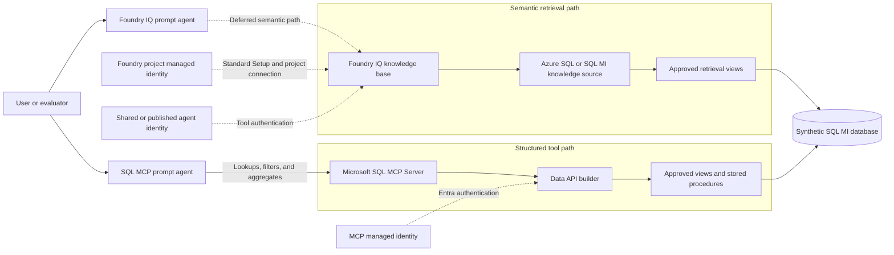
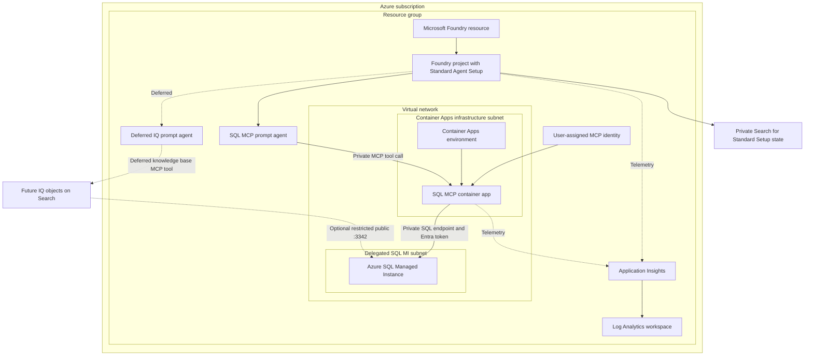
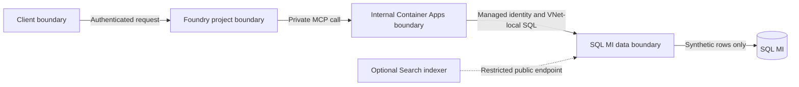

# Architecture

## Scope and status

This document defines the target architecture and current implementation boundary. Phase 2 Bicep is implemented and partially deployed in Central US. SQL MI, networking, managed identity, monitoring, private Standard Agent Setup dependencies, Foundry account/project/model, project connections, private endpoints, and the project capability host have succeeded. The internal Container Apps environment requires an idempotent retry after regional `AKSCapacityHeavyUsage`. Database objects, SQL authorization, SQL MCP Server, prompt-agent versions, and Foundry IQ data-plane objects remain deferred.

The architecture uses two project-native Microsoft Foundry prompt agents with deliberately different data paths:

1. The primary SQL MCP agent uses Microsoft SQL MCP Server, built on Data API builder, for deterministic operations over an allowlisted SQL contract.
2. The deferred Foundry IQ agent uses a knowledge base for semantic retrieval and grounded narrative responses.

Both agents use the same model deployment, baseline instructions, domain, and evaluation dataset. The tool configuration is the intentional experimental variable.

## Logical architecture

## Target deployment topology

The SQL MCP path uses Foundry Standard Agent Setup with BYO VNet because Basic Agent Setup can't reach a private MCP server. The Container Apps environment is internal-only and uses a dedicated subnet delegated to `Microsoft.App/environments`. The MCP server reaches the SQL MI VNet-local endpoint on TCP `1433`.

The private Search service shown as `StateSearch` is mandatory Standard Agent Setup infrastructure; it stores agent vector state and doesn't contain an Azure SQL knowledge source or Foundry IQ knowledge base in Phase 2. If a later customer test enables the IQ profile, only its Search indexer uses the SQL MI public FQDN on TCP `3342`; the MCP server continues to use the VNet-local FQDN on TCP `1433`.

## Trust boundaries

- Neither Foundry prompt agent receives database credentials or a general SQL execution tool.
- The MCP container authenticates as its own managed identity and receives only custom database-role grants.
- Foundry IQ indexes or retrieves only from approved views with stable keys and citation fields.
- Raw tables remain behind the database boundary.
- Deployment authority is separate from every runtime identity.
- The optional Search public path is a second SQL MI listener, not a route used by MCP.
- The project managed identity, shared project agent identity, and published agent identities are distinct principals. A connection configured for Project Managed Identity uses the project principal; an Agentic Identity connection uses the selected shared or published agent principal.
- `Foundry Agent Consumer` authorizes endpoint invocation but doesn't automatically apply per-user SQL row filtering. The default workload-identity paths return the data authorized to the MCP or Search identity.

## Agent registration model

Both agents are registered through `azure-ai-projects` 2.x with `AIProjectClient.agents.create_version` and `PromptAgentDefinition`. Each call creates an immutable project agent version that is visible in the new Microsoft Foundry portal and available in its Playground.

| Agent | MCP server URL | Allowed tools | Approval posture |
|---|---|---|---|
| SQL MCP | Internal SQL MCP endpoint | Explicit allowlist generated from approved views/procedures | `never` only while every exposed tool is read-only |
| Foundry IQ | `{search-endpoint}/knowledgebases/{kb}/mcp?api-version=2026-05-01-preview` | `knowledge_base_retrieve` | `never` because retrieval is read-only |

Any future write tool must be added to a different agent version, use explicit approvals, and receive a separate security decision.

## Retrieval routing

| Request shape | Route | Reason |
|---|---|---|
| Narrative summary, theme discovery, document-oriented question | Foundry IQ comparison agent | Semantic retrieval with evidence and citations |
| Exact client or account lookup | SQL MCP primary agent | Parameterized, deterministic entity operation |
| Filter, count, grouping, status, or risk list | SQL MCP primary agent | Structured result with predictable semantics |
| Unsupported or ambiguous request | No data call until clarified | Avoid invented data and over-broad retrieval |
| Write request | Deny | The accepted architecture is read-only; no write mode is approved |

## Planned SQL contract

Foundry IQ inputs:

- `vw_transfer_summary`
- `vw_client_account_overview`
- `vw_transfer_risk_dashboard`
- `vw_advisor_pipeline`

SQL MCP entities:

- The four approved views above
- `usp_GetTransferSummaryByClient`
- `usp_GetOpenRiskAlerts`
- `usp_GetAdvisorPipeline`

The physical tables remain implementation details of the synthetic dataset and are not agent-facing contracts.

## Phase boundaries

| Phase | Architectural outcome |
|---|---|
| 1 | Contracts, diagrams, secure defaults, no-resource Bicep composition |
| 2 | Standard Agent Setup network, identity, monitoring, SQL MI, internal Container Apps, Foundry project, and model infrastructure; partially deployed pending CAE retry |
| 3-4 | Synthetic schema/data and least-privilege SQL authorization |
| 5 | Read-only SQL MCP implementation and private connectivity validation |
| 6 | SQL MCP prompt-agent registration and evaluation |
| 7 | Optional Foundry IQ/Search profile and comparison prompt agent |
| 8 | Security, exposure, behavior, infrastructure, and end-to-end validation |

## Data boundary

All data must be synthetic. Customer, employee, partner, production, or copied operational data is outside the scope of this repository.
