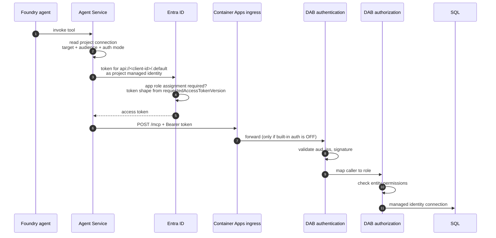

# How Foundry-to-MCP authentication is supposed to work

This document defines the **target state**. It describes every component that participates in
authenticating a Foundry agent to the SQL MCP Server, what each one must be set to, and how to
verify it. It is deliberately written as a contract rather than as a troubleshooting narrative,
so it can be walked top to bottom against any deployment.

Use [`scripts/verify-auth-chain.ps1`](../scripts/verify-auth-chain.ps1) to evaluate all of it at
once. Use [the runbook's 401 section](demo-portal-runbook.md#diagnosing-a-401-from-the-agent) when
something here does not match.

## The chain

A single agent tool call crosses seven boundaries. A failure at any one of them surfaces to the
user as the same generic message, which is why identifying the hop matters more than trying fixes.



Two distinct things are often conflated:

- **Authentication** is DAB deciding whether the token is valid. Failure returns `401`.
- **Authorization** is DAB deciding whether the caller's role may touch the entity. Failure returns
  `Authorization Failure: Access Not Allowed`.

They have different causes and different fixes. A deployment can pass authentication and still fail
authorization, which looks like a data problem rather than an auth problem.

## Component contract

### 1. Entra application registration — the API definition

The application registration *is* the audience. It defines what Foundry asks for and what DAB trusts.

| Property | Required value | Why |
|---|---|---|
| `identifierUris` | `api://<client-id>` | The value Foundry requests a token for |
| `appRoles[].value` | `Mcp.Invoke` | The permission carried in the token |
| `appRoles[].allowedMemberTypes` | `["Application"]` | A managed identity is an application, not a user |
| `api.requestedAccessTokenVersion` | **`2`** | Determines the shape of every claim DAB validates |
| `signInAudience` | `AzureADMyOrg` | Single tenant |

**The token version is the property most likely to be wrong.** Neither `az ad app create` nor the
portal sets it, and the unset default is v1:

| | `aud` | `iss` |
|---|---|---|
| v1 — the default | `api://<client-id>` | `https://sts.windows.net/<tenant-id>/` |
| v2 — required | `<client-id>` | `https://login.microsoftonline.com/<tenant-id>/v2.0` |

DAB is configured for the v2 shape, so leaving this unset fails **both** claims at once while the
token still legitimately carries `Mcp.Invoke`. Nothing upstream reports an error.

```powershell
az ad app show --id <client-id> `
  --query '{tokenVersion:api.requestedAccessTokenVersion, idUris:identifierUris, roles:appRoles[].value}' -o json
```

### 2. Service principal — the caller allowlist

The enterprise application is the object that role assignments attach to.

| Property | Required value | Why |
|---|---|---|
| Service principal | must exist | Entra will not issue tokens for a resource without one |
| `appRoleAssignmentRequired` | `true` | Restricts token issuance to assigned identities |
| App role assignment | Foundry project identity → `Mcp.Invoke` | Without it, Entra refuses to issue the token |

With `appRoleAssignmentRequired = true` and no assignment, the failure happens at **token
acquisition** — before any network call to MCP. The agent still reports a connection error, which
misleadingly points at the endpoint.

```powershell
az ad sp show --id <client-id> --query '{spId:id, assignmentRequired:appRoleAssignmentRequired}' -o json
az rest --method get --url "https://graph.microsoft.com/v1.0/servicePrincipals/<project-principal-id>/appRoleAssignments" --query 'value[].{resourceId:resourceId,appRoleId:appRoleId}' -o json
```

### 3. Foundry project connection — where the request is aimed

| Property | Required value |
|---|---|
| `category` | `RemoteTool` |
| `target` | `https://<container-app-fqdn>/mcp` |
| `authType` | `ProjectManagedIdentity` |
| `useWorkspaceManagedIdentity` | `true` |
| `audience` | `api://<client-id>` |

**The audience here and the audience in DAB are intentionally different.** The connection requests
`api://<client-id>`; Entra issues a token whose `aud` is the bare GUID. Making them match is a
common and counterproductive "fix".

The target must be exactly `/mcp` — no trailing slash, no extra segment, no query string.

### 4. Container App ingress — the network boundary

| Property | Required value | Why |
|---|---|---|
| `ingress.external` | `true` | Foundry is public in this topology and calls in over the internet |
| `ingress.targetPort` | `5000` | DAB's listening port |
| **Built-in authentication** | **disabled** | It returns `401` before traffic reaches DAB |
| `minReplicas` | `1` for demos | Avoids cold-start latency; unrelated to auth |

Container Apps built-in authentication (Easy Auth) is **not part of this design**. Foundry
authenticates to DAB directly with an Entra token, and DAB performs its own validation. Enabling
platform authentication puts a second, unconfigured authentication layer in front of DAB that
rejects the call before it arrives.

```powershell
az containerapp auth show -n <app> -g <rg> --query '{enabled:platform.enabled, action:globalValidation.unauthenticatedClientAction}'
```

### 5. DAB authentication — what is baked into the image

The audience and issuer are **build-time** values inside the image, not environment variables. A
corrected application registration does not fix an image built with the wrong values.

| Config path | Required value |
|---|---|
| `runtime.host.authentication.provider` | `EntraID` |
| `runtime.host.authentication.jwt.audience` | `<client-id>` — the bare GUID |
| `runtime.host.authentication.jwt.issuer` | `https://login.microsoftonline.com/<tenant-id>/v2.0` |
| `runtime.host.mode` | `production` |
| `runtime.mcp.enabled` | `true` |

The committed `dab-config.json` ships placeholders (`00000000-…` and `11111111-…`) that
`scripts/build-demo-mcp.ps1` substitutes into an ignored build context. **Building the image
directly from `src/mcp-server/` bypasses that substitution**, and DAB then trusts an audience no
token will ever carry.

```powershell
az containerapp exec -n <app> -g <rg> --command "cat /App/dab-config.json"
```

### 6. DAB authorization — entity permissions

Foundry does not send the `X-MS-API-ROLE` header, so DAB evaluates the call as its built-in
`authenticated` role. Every entity the agent may use must therefore grant `authenticated`, or a
role matching a claim the token actually carries.

```json
"permissions": [
  { "role": "Mcp.Invoke",    "actions": ["read"] },
  { "role": "authenticated", "actions": ["read"] }
]
```

This is the hop behind `Authorization Failure: Access Not Allowed`. **It also means disabling
authentication is not sufficient to test anonymously** — an anonymous caller maps to the
`anonymous` role, which these entities do not grant, so the call still fails. Testing without auth
requires adding an `anonymous` role *as well as* relaxing authentication, and reverting both after.

### 7. The agent definition — the tool allowlist

| Property | Required value |
|---|---|
| `project_connection_id` | the connection name from component 3 |
| `server_url` | the same `/mcp` endpoint |
| `allowed_tools` | only tools that exist for **your** entities |

`allowed_tools` in `src/agent/register_agent.py` lists the demo's tools, including stored-procedure
tools such as `get_transfer_summary_by_client`. Pointing the server at different entities without
updating this list leaves the agent allowed to call tools the server does not expose. Generic tools
(`describe_entities`, `read_records`, `aggregate_records`) exist for any entity set.

Agent versions are immutable. Editing a connection does not update an already-registered version —
re-register and confirm the agent is using the new version.

## Failure signatures

| Symptom | Hop | Component |
|---|---|---|
| `401` from the agent, unauthenticated `/api` also returns `401` | 6 | Built-in authentication is on (4) |
| `401` from the agent, unauthenticated `/api` returns `404` | 7 | Token shape (1), image values (5), or connection (3) |
| Connection error with no request reaching the app | 3–5 | Missing app role assignment (2) or wrong target (3) |
| `Authorization Failure: Access Not Allowed` | 8 | Entity permissions (6) — authentication already succeeded |
| Agent describes entities but cannot call tools | 7 or — | Auth failing, or `allowed_tools` mismatch (7) |
| Slow first call, then success | — | `minReplicas 0`. Not an auth fault |

**DAB logs nothing when it rejects a token** — no `IDX` code, no request line, not at any log level.
Verified against `data-api-builder:2.0.9`. Empty logs are the normal appearance of a rejection, so
they cannot be used to prove traffic never arrived.

Use response codes instead. Unauthenticated, a healthy DAB returns:

| Path | Code |
|---|---|
| `/api` | `404` |
| `/mcp` | `406` |
| unknown path | `400` |
| `/health` | `403` |

**None of them are `401`.** So an unauthenticated `/api` returning `401` proves something in front
of DAB answered.

## Verify everything at once

```powershell
./scripts/verify-auth-chain.ps1 `
  -ResourceGroup <rg> `
  -ContainerApp <app> `
  -McpAppId <client-id> `
  -ProjectPrincipalId <foundry-project-principal-id>
```

Read-only. It evaluates components 1, 2, 4, 5 and 6, probes the live endpoint to establish which
component answers, and reports each check as PASS, FAIL or WARN. Components 3 and 7 are read from
the Foundry portal, since the connection and agent definition are project-scoped.
