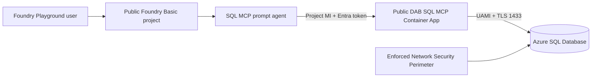
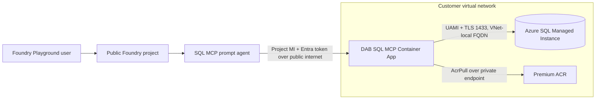

# Portal-First Public SQL MCP Setup

This runbook recreates the simplified `demo/public-evaluation` environment. It uses Azure and Microsoft Foundry portals for resource configuration and the repository scripts for artifact operations that the portals don't perform reliably: validating Bicep/DAB, building the pinned container image, applying SQL migrations, assigning an application role to a managed identity, and registering an immutable prompt-agent version.

The deployed environment is public for evaluation, contains synthetic data only, and expires on the date selected by the operator. It does not deploy Foundry IQ, Azure AI Search, a VNet, or private endpoints.

> [!IMPORTANT]
> This is a demo runbook, not the customer production runbook. It does not assume that a customer will permit public database access. Customer Azure SQL Database should use private endpoints where required, SQL Managed Instance should use its private VNet endpoint, and on-premises SQL Server should use local placement or VPN/ExpressRoute. See [SQL Backend Options](sql-backend-options.md).

## Choose your deployment path

> [!TIP]
> **Recommended fast path: deploy with IaC.** You do not need to perform every portal step manually. Use the repository's idempotent `azd up` workflow to provision and configure the complete public demo. Use the numbered portal sections when you want to understand each component, verify the deployment, or recover one stage selectively.

| Path | Choose it when | Result |
|---|---|---|
| **IaC with `azd up`** | You want a repeatable, validated deployment with the least manual work | Provisions Azure resources and completes Entra, DAB, SQL, Foundry connection, agent registration, and smoke tests |
| **Portal walkthrough** | You are learning the architecture, need customer-facing screenshots, or must configure/review resources individually | Produces the same architecture through explicit portal and script steps |

> [!WARNING]
> **Portability is conditional, not universal.** The workflow is validated end to end in the reference MCAPS tenant/subscription on Windows with PowerShell 7. Tenant and subscription IDs are parameterized, but each customer must pass the preflight below. Tenant policy, unavailable providers/SKUs, model quota, regional capacity, or insufficient Entra privileges can block deployment.

### Customer preflight

| Requirement | Customer validation |
|---|---|
| Deployment workstation | Windows with PowerShell 7, Git, Azure CLI, azd, Python 3, .NET SDK, and `winget`; other operating systems are not yet validated by this workflow |
| Azure context | An active subscription in the intended tenant; pass both IDs explicitly to environment setup |
| Azure permissions | Permission to create the documented resources and Azure role assignments in the target subscription/resource group |
| Entra permissions | Permission to create/update an app registration and service principal and assign its application role to the Foundry project identity |
| Resource providers | `Microsoft.CognitiveServices`, `Microsoft.App`, `Microsoft.Sql`, `Microsoft.Network`, `Microsoft.ContainerRegistry`, `Microsoft.OperationalInsights`, `Microsoft.Insights`, and `Microsoft.ManagedIdentity` available/registered |
| Foundry/model | Foundry project creation and `gpt-5.4-mini` deployment supported in the selected app region, with sufficient model quota/capacity |
| Azure SQL | Logical-server/database creation allowed in the selected SQL region and Entra-only administrator assignment permitted |
| NSP | Network Security Perimeter and `SecuredByPerimeter` supported and permitted; this is a reference-subscription demo workaround, not a universal customer requirement |
| Network/policy | No deny/modify policy conflicts beyond those explicitly handled by the template |

If the customer requires private Azure SQL, SQL MI, on-premises SQL Server, a different model, or a non-Windows deployment host, adapt and validate the appropriate profile in [SQL Backend Options](sql-backend-options.md) before using this command.

### IaC prerequisites

Install these tools on the deployment workstation:

- PowerShell 7
- Git
- Azure CLI
- Azure Developer CLI (`azd`)
- Python 3
- .NET SDK
- `winget` on Windows

The `preup` hook installs or converges Data API builder 2.0.9, modern sqlcmd, the workspace Python virtual environment, and pinned agent SDK packages. The operator still needs the Azure/Entra permissions listed under [Required access](#required-access).

Authenticate and select the approved branch, subscription, and tenant:

```powershell
git switch demo/public-evaluation
$tenantId = '<customer-tenant-id>'
$subscriptionId = '<customer-subscription-id>'
az login --tenant $tenantId
az account set --subscription $subscriptionId
azd auth login --tenant-id $tenantId
```

Create or refresh the non-secret azd environment. Choose the approved expiration date for the disposable resources:

```powershell
./scripts/setup-demo-environment.ps1 `
  -EnvironmentName foundry-sql-mcp-demo `
  -SubscriptionId $subscriptionId `
  -TenantId $tenantId `
  -Location <validated-app-region> `
  -SqlLocation <validated-sql-region> `
  -ExpirationDate <yyyy-mm-dd>
```

Preview the control-plane deployment if required by your change process:

```powershell
azd provision --preview --environment foundry-sql-mcp-demo --no-prompt
```

Run the complete deployment:

```powershell
azd up --environment foundry-sql-mcp-demo --no-prompt
```

### What `azd up` completes

The root hooks in `azure.yaml` make `azd up` an end-to-end workflow:

1. Validates Bicep, DAB, SQL, Python, and local prerequisites.
2. Creates or reconciles Foundry, the model deployment, monitoring, ACR, managed identity, Container Apps environment, Azure SQL Database, and the demo NSP.
3. Creates or reconciles the Entra MCP application, `Mcp.Invoke` app role, assignment-required service principal, and project-identity assignment.
4. Reuses or builds the content-addressed DAB 2.0.9 image.
5. Applies idempotent SQL schema, seed, view, procedure, role, and contained-user migrations. Temporary SQL bootstrap access is always restored in `finally`.
6. Performs the image-dependent Bicep pass for the Container App and Foundry RemoteTool connection.
7. Reuses an unchanged prompt-agent version or creates a new version only when its definition changes.
8. Verifies Container App health and runs the three deterministic agent smoke tests.

The workflow is idempotent. Re-running the same source state reconciles resources without duplicating Entra assignments, SQL records, ACR image content, or agent versions. A repeat run was validated with unchanged Azure resource count, image-tag count, agent-version count, and active image.

After the command succeeds, open **Microsoft Foundry portal > `project-foundry-sql-mcp-demo` > Build > Agents > `transfer-agent-sql-mcp-demo` > Playground**. Continue with [Validate in the portals](#14-validate-in-the-portals) for the manual review checklist.

## Components and why they exist

Read this section before creating resources. The solution separates model hosting, agent orchestration, MCP hosting, database access, and identity so each principal and service can receive only the access it needs.

| Component | What it is | Why this solution needs it |
|---|---|---|
| Repository, Bicep, and Azure Developer CLI (`azd`) | The versioned source and deployment tooling for infrastructure, SQL, DAB configuration, and agent registration | Makes the portal walkthrough reproducible and prevents undocumented portal drift |
| Azure resource group | A lifecycle and access-management boundary for related Azure resources | Keeps the disposable demo isolated, tagged, auditable, and removable as one unit |
| Log Analytics workspace | Azure's central log store and query engine | Receives platform and NSP diagnostics used to troubleshoot denied SQL traffic |
| Application Insights | Azure application performance and distributed telemetry service | Provides the Foundry project monitoring connection and a place for application telemetry as instrumentation is enabled |
| User-assigned managed identity (UAMI) | An Entra workload identity whose lifecycle is independent of one compute resource | Lets DAB pull its image and authenticate to Azure SQL without passwords |
| Azure Container Registry (ACR) | A private registry for OCI/Docker container images | Stores the pinned, configuration-specific SQL MCP Server image |
| Container Apps environment | The shared Azure Container Apps hosting boundary for networking, logging, and revisions | Provides serverless container hosting without managing Kubernetes |
| SQL MCP Container App | The running DAB 2.0.9 container with HTTPS ingress | Hosts the `/mcp` endpoint that Foundry calls and uses the UAMI to reach SQL |
| Microsoft Foundry resource | The Azure account-level boundary for models, projects, RBAC, and connections | Hosts the model deployment and the project used by the demo agent |
| Foundry project | The development and runtime boundary for agents, tools, connections, and project identity | Owns the RemoteTool connection and supplies the managed identity used to call MCP |
| Model deployment | A named deployment of `gpt-5.4-mini` with allocated capacity | Provides the reasoning model used by the prompt agent |
| Prompt agent | A versioned Foundry agent definition containing model, instructions, and allowed tools | Converts user requests into approved SQL MCP tool calls and summarizes grounded results |
| Azure SQL logical server | The management and authentication boundary for Azure SQL databases | Supplies the Entra administrator, TLS/network settings, and database endpoint |
| Azure SQL Database | The managed relational database containing the synthetic transfer dataset | Stores the tables while exposing only curated views and stored procedures to MCP |
| Network Security Perimeter (NSP) | An Azure network boundary for supported PaaS resources with explicit access rules | Required only in this demo subscription because policy disables ordinary Azure SQL public access; it is not a SQL MCP requirement |
| Entra application registration | The definition of the SQL MCP API audience and `Mcp.Invoke` application role | Gives Foundry a target audience for token acquisition and restricts token issuance to assigned workloads |
| Enterprise application/service principal | The tenant-local instance of the Entra application | Enforces assignment-required and holds the Foundry project identity's `Mcp.Invoke` assignment |
| SQL MCP Server / Data API builder (DAB) | Microsoft's SQL MCP Server runtime, configured by `dab-config.json` | Converts structured MCP calls into deterministic, permission-checked SQL operations without NL2SQL |
| `dab-config.json` | DAB's declarative contract for data source, authentication, tools, entities, fields, and permissions | Determines exactly which database objects and operations agents can discover and invoke |
| Curated SQL contract | Four views, three stored procedures, role `mcp_reader`, and the MCP contained user | Keeps raw tables and writes outside the agent-facing boundary even if another layer is misconfigured |
| Foundry RemoteTool connection | Project metadata describing the MCP URL, audience, and authentication identity | Tells Agent Service where MCP is and how to obtain the Entra token sent to it |

### Identity flow

The identities are intentionally different:

1. The human setup operator creates/configures resources and applies SQL migrations.
2. The Foundry project system-assigned identity calls the MCP endpoint and must have `Mcp.Invoke` on the MCP enterprise application.
3. The MCP UAMI runs with the Container App, pulls from ACR, and connects to SQL as the contained database user in `mcp_reader`.
4. End users invoke the agent through Foundry RBAC; they do not receive direct SQL access from that role.

## Target architecture



## Reference values

| Setting | Value |
|---|---|
| Subscription | `MCAPS-Internal-Non-Prod` (`49d5f6b0-70f2-4563-acdc-9a31d2eee119`) |
| Tenant | `16b3c013-d300-468d-ac64-7eda0820b6d3` |
| Resource group | `rg-foundry-sql-mcp-demo` |
| Foundry/Container Apps region | East US 2 |
| SQL/NSP region | Central US |
| Foundry project | `project-foundry-sql-mcp-demo` |
| Model deployment | `gpt-5.4-mini`, version `2026-03-17`, Global Standard, capacity 10 |
| SQL database | `TransferDemo`, Basic, 2 GB |
| DAB version | `2.0.9` |
| Agent | `transfer-agent-sql-mcp-demo` |

The split regions are deliberate. This subscription rejects new Azure SQL logical servers in East US 2, while Central US previously had Container Apps capacity pressure.

## Private topology variant — VNet-injected Container Apps with private ACR and SQL MI

The numbered steps below build the **public evaluation topology**: a public Container Apps environment reaching a public Azure SQL Database. That is correct for a disposable demo and wrong for a customer whose database must not be reachable from the internet.

This section defines the **hybrid variant** used when the database is Azure SQL Managed Instance and must be reached privately. Everything Foundry-side stays public; everything data-side moves inside the virtual network.

> [!TIP]
> **There is an executable notebook for this variant.** [`notebooks/hybrid-setup.ipynb`](../notebooks/hybrid-setup.ipynb) runs the whole sequence cell by cell — from an empty subscription through to a working agent, including SQL MI, Foundry, the Entra application and the data contract. Every cell checks before it creates, so it is safe to re-run from any partially-deployed state. Use this section for the reasoning and the notebook for the execution. It needs VS Code with the Polyglot Notebooks extension — it will not run in Azure Cloud Shell.



### What moves, and what does not

| Component | Public evaluation | Private variant | Recreate? |
|---|---|---|---|
| Foundry resource, project, model | Public | **Unchanged — stays public** | No |
| Foundry → MCP security | Entra token, `Mcp.Invoke` | **Unchanged** — the boundary is authentication, not the network | No |
| Container Apps environment | Public, non-VNet | **VNet-injected**, dedicated subnet | **Yes** — VNet config is fixed at creation |
| Container registry | Basic/Standard, public | **Premium** with a private endpoint | **Yes** — private endpoints require Premium |
| SQL backend | Public Azure SQL Database | **SQL MI, VNet-local endpoint only** | No |
| SQL public endpoint (3342) | n/a | **Disabled** | — |

> [!IMPORTANT]
> **Foundry does not move into the VNet, and does not need to.** Agent Service calls the MCP endpoint over the public internet and presents an Entra token carrying `Mcp.Invoke`, which DAB validates against the configured audience and issuer. That token is the trust boundary between Foundry and MCP. Network isolation protects the path from MCP to the data, which is where the customer's data actually sits.

### Why each change is required

**The Container Apps environment must be recreated, not reconfigured.** VNet configuration is fixed when an environment is created. A public environment also has no stable outbound address — outbound IPs may change over time, and pinning them behind a NAT Gateway is supported only in a workload profile environment. Once the environment is VNet-injected, source-IP allowlisting stops being a problem: the source becomes a **subnet CIDR** you control.

**The registry must be Premium.** Private endpoints for Azure Container Registry are a Premium-tier feature. Basic and Standard registries cannot have one, so a registry created at a lower tier has to be replaced rather than upgraded in place for this purpose. The private endpoint uses the `privatelink.azurecr.io` DNS zone.

**SQL MI is already VNet-resident.** Unlike Azure SQL Database, SQL Managed Instance is always deployed into a delegated subnet and always has a VNet-local endpoint. "Connecting privately" therefore does not mean adding a private endpoint — it means placing the MCP runtime somewhere that can route to the MI subnet, using the VNet-local FQDN on **1433**, and disabling the optional public endpoint on **3342**.

### Provision the network

These steps create the network prerequisites. They are ordinary Azure networking operations.

> [!IMPORTANT]
> **You cannot reuse the SQL Managed Instance subnet, but you can use its virtual network.**
> The MI subnet — usually named `ManagedInstance` — is delegated to
> `Microsoft.Sql/managedInstances`. Selecting it for a private endpoint or a Container Apps
> environment fails with:
>
> ```text
> The selected subnet 'ManagedInstance' has a delegation and cannot be used with a private endpoint.
> The selected subnet 'ManagedInstance' has a delegation and cannot be used.
> ```
>
> This is a **subnet** constraint, not a virtual network constraint. A delegated subnet cannot host
> private endpoints, and a subnet delegated to one service cannot be delegated to another. The fix is
> to add **new, separate subnets** to the same virtual network — not to build a second network.

You will end up with three subnets in one virtual network:

| Subnet | Delegation | Size | Holds |
|---|---|---|---|
| `ManagedInstance` (existing) | `Microsoft.Sql/managedInstances` | existing | SQL MI only — leave untouched |
| `snet-aca-mcp` (new) | `Microsoft.App/environments` | **/27** or larger | The Container Apps environment |
| `snet-private-endpoints` (new) | **none** | /28 is usually enough | The ACR private endpoint |

Resources in different subnets of the same virtual network route to each other by default, so no
peering, route tables or NSG rules are required for the container to reach SQL MI.

> [!NOTE]
> **Permissions.** You need `Network Contributor` on the virtual network, or a role that allows
> creating subnets, delegations, private DNS zones and virtual network links.

### Variables used throughout this section

Set these once. Every command below uses them, so a value entered here does not need repeating.

> [!IMPORTANT]
> **`$rg` and `$vnetRg` are frequently different.** The virtual network hosting SQL MI often lives in
> a network resource group rather than the application resource group. Commands that act on the
> network use `$vnetRg`; commands that act on application resources use `$rg`. Setting both to the
> same value when they differ is the most common cause of `ResourceNotFound` in this section.

```powershell
# Application resources
$rg           = '<app-resource-group>'
$location     = '<region>'
$acrName      = '<new-premium-registry-name>'
$envName      = '<new-vnet-environment-name>'
$appName      = '<container-app-name>'
$identityName = '<mcp-uami-name>'

# Network resources
$vnetRg       = '<vnet-resource-group>'     # the RG containing the SQL MI virtual network
$vnetName     = '<vnet-hosting-sql-mi>'
$acaSubnet    = 'snet-aca-mcp'
$peSubnet     = 'snet-private-endpoints'

# Resolved once and reused
$identityId   = az identity show --name $identityName --resource-group $rg --query id -o tsv
$identityPrin = az identity show --name $identityName --resource-group $rg --query principalId -o tsv
```

**1. Inspect the SQL MI virtual network and find free address space**

```powershell
# Locate the managed instance and the subnet it is delegated into
az sql mi list --query "[].{name:name, subnet:subnetId}" -o table

# Address space and subnets already in use
az network vnet show --resource-group $vnetRg --name $vnetName `
  --query "{addressSpace:addressSpace.addressPrefixes, subnets:subnets[].{name:name, prefix:addressPrefix, delegation:delegations[0].serviceName}}" -o json
```

The output confirms the delegation on the MI subnet and shows what address space remains. Choose
ranges that do not overlap anything listed.

If there is no free space, extend the virtual network rather than creating a second one. This is a
non-disruptive operation and keeps you on the simpler topology:

```powershell
az network vnet update --resource-group $vnetRg --name $vnetName `
  --address-prefixes <existing-range> <new-range>
```

**2. Create the Container Apps subnet and delegate it**

The subnet must be dedicated — no other resource may use it.

```powershell
# /27 or larger for a workload profiles environment (/23 or larger for legacy Consumption-only)
az network vnet subnet create --resource-group $vnetRg --vnet-name $vnetName `
  --name $acaSubnet --address-prefixes <aca-range>

# Workload profiles environments REQUIRE this delegation.
# Consumption-only environments must NOT be delegated.
az network vnet subnet update --resource-group $vnetRg --vnet-name $vnetName `
  --name $acaSubnet --delegations Microsoft.App/environments
```

**3. Create the private-endpoint subnet — with no delegation**

Do not delegate this subnet to anything. A delegation here reproduces the error above.

```powershell
az network vnet subnet create --resource-group $vnetRg --vnet-name $vnetName `
  --name $peSubnet --address-prefixes <pe-range>          # /28 is usually sufficient

# Private endpoint network policies must be disabled on this subnet.
# Recently created subnets default to Disabled; verify rather than assume.
az network vnet subnet show --resource-group $vnetRg --vnet-name $vnetName `
  --name $peSubnet --query privateEndpointNetworkPolicies -o tsv

# If it returns anything other than Disabled:
az network vnet subnet update --resource-group $vnetRg --vnet-name $vnetName `
  --name $peSubnet --disable-private-endpoint-network-policies true
```

**4. Create the private DNS zone for the registry and link it to the virtual network**

Create the zone now; the endpoint's records are added later by the `dns-zone-group` command, once
the registry exists.

```powershell
az network private-dns zone create --resource-group $vnetRg --name 'privatelink.azurecr.io'

az network private-dns link vnet create --resource-group $vnetRg `
  --zone-name 'privatelink.azurecr.io' --name "link-$vnetName" `
  --virtual-network $vnetName --registration-enabled false
```

**5. Confirm DNS behaviour before going further**

```powershell
az network vnet show --resource-group $vnetRg --name $vnetName --query dhcpOptions.dnsServers -o json
```

An empty result means the virtual network uses Azure-provided DNS and the private zone resolves
automatically. If custom DNS servers are listed, those servers must forward `privatelink.azurecr.io`
to Azure DNS at `168.63.129.16`, or private resolution fails even though every resource is configured
correctly. Confirm with whoever runs those servers before continuing.

Note that SQL MI requires its custom DNS to resolve public DNS records as well, so a
misconfiguration here can affect the managed instance rather than only the new components.

**6. Verify the network is ready**

```powershell
az network vnet subnet show --resource-group $vnetRg --vnet-name $vnetName `
  --name $acaSubnet --query "{prefix:addressPrefix, delegation:delegations[0].serviceName}" -o json

az network vnet subnet show --resource-group $vnetRg --vnet-name $vnetName `
  --name $peSubnet --query "{prefix:addressPrefix, delegation:delegations[0].serviceName, policies:privateEndpointNetworkPolicies}" -o json
```

Expect the Container Apps subnet delegated to `Microsoft.App/environments`, and the private-endpoint
subnet with **no delegation** and policies `Disabled`. If either shows an unexpected delegation, fix
it before creating any resource that depends on it.

SQL MI itself needs no private endpoint and no additional DNS zone. It is already virtual-network
resident with a VNet-local endpoint; once the Container Apps subnet exists in the same virtual
network, the routing question is answered.

### If the SQL MI virtual network cannot be used

Extending the existing virtual network is the simpler path and should be the default. Use a separate
virtual network with peering only where policy forbids adding subnets to the MI network, or the
address space cannot be extended.

```powershell
$miVnetId  = az network vnet show --resource-group $vnetRg --name $vnetName --query id -o tsv
$acaVnetId = az network vnet show --resource-group $rg --name '<aca-vnet>' --query id -o tsv

# Peering must exist in BOTH directions. A one-way peering silently fails to route.
az network vnet peering create --resource-group $rg --vnet-name '<aca-vnet>' `
  --name 'aca-to-mi' --remote-vnet $miVnetId --allow-vnet-access

az network vnet peering create --resource-group $vnetRg --vnet-name $vnetName `
  --name 'mi-to-aca' --remote-vnet $acaVnetId --allow-vnet-access
```

Also link `privatelink.azurecr.io` to the second virtual network, or the Container App will not
resolve the registry privately:

```powershell
az network private-dns link vnet create --resource-group $vnetRg `
  --zone-name 'privatelink.azurecr.io' --name 'link-aca-vnet' `
  --virtual-network $acaVnetId --registration-enabled false
```

Verify name resolution of the SQL MI VNet-local FQDN from the Container Apps subnet before deploying
the container. Peered networks route by default, but custom DNS or a firewall appliance in the path
can still break resolution.

> [!NOTE]
> **If you take this path, adjust the variables.** The Container Apps and private-endpoint subnets
> are then created in the new virtual network rather than the SQL MI one. Point `$vnetName` at the
> new network and `$vnetRg` at its resource group before running the subnet commands above, and keep
> a separate variable for the SQL MI network so the peering commands still resolve it.

### Order of operations

Two constraints dictate the sequence, and getting it wrong means redoing work.

> [!WARNING]
> **Build and push the image before you lock the registry down.** Microsoft documents that
> "if you disable public access to a registry, `az acr build` commands no longer work" — ACR Tasks
> require public IPs unless you assign a dedicated agent pool or allowlist the regional
> `AzureContainerRegistry` service tag. Build first, verify the image exists, then disable public
> network access.

> [!WARNING]
> **A new registry means a new image.** The image lives in the registry, so creating a Premium
> registry means rebuilding and pushing into it. Re-run step 9's build against the new registry name
> before creating the Container App.

1. Provision the network - new subnets, delegation, DNS zone (above)
2. Create the Premium registry with public access still enabled
3. Build and push the image (step 9) into the new registry
4. Add the registry private endpoint and DNS records
5. Disable public network access on the registry
6. Create the VNet-injected Container Apps environment
7. Apply the SQL contract on SQL MI (step 10)
8. Create the Container App (step 11) with the VNet-local connection string
9. Disable the SQL MI public endpoint
10. Create the Foundry connection and agent (steps 12–13), unchanged
11. Decommission the old public environment, container app and registry

### Executable steps

These continue from **Provision the network** above and reuse the same variables. The subnets,
delegation, DNS zone and virtual network link already exist by this point — nothing below recreates
them.

**1. Premium registry, public access still enabled**

```powershell
az acr create --name $acrName --resource-group $rg --location $location --sku Premium
az acr config authentication-as-arm update -r $acrName --status enabled

$acrId = az acr show --name $acrName --query id -o tsv
az role assignment create --assignee-object-id $identityPrin `
  --assignee-principal-type ServicePrincipal --role AcrPull --scope $acrId
```

**2. Build the image into the new registry** — this is step 9's build, re-pointed. Do it now, while
the registry is still publicly reachable.

```powershell
./scripts/build-demo-mcp.ps1 -RegistryName $acrName `
  -McpApplicationId <mcp-app-client-id> -TenantId <tenant-id>

az acr repository show-tags --name $acrName --repository sql-mcp -o table   # confirm it landed
```

**3. Registry private endpoint and DNS records**

The zone and the virtual network link were created in **Provision the network**. This step creates
the endpoint and populates the zone with its records.

```powershell
# The endpoint is created in the network resource group, into the subnet built earlier
az network private-endpoint create `
  --name "pe-$acrName" --resource-group $vnetRg `
  --vnet-name $vnetName --subnet $peSubnet `
  --private-connection-resource-id $acrId `
  --group-ids registry --connection-name "conn-$acrName"

# Resolve the zone by ID so this works even when the zone and endpoint are in different groups
$zoneId = az network private-dns zone show --resource-group $vnetRg `
  --name 'privatelink.azurecr.io' --query id -o tsv

az network private-endpoint dns-zone-group create `
  --resource-group $vnetRg --endpoint-name "pe-$acrName" `
  --name 'default' --private-dns-zone $zoneId --zone-name 'acr'
```

> [!IMPORTANT]
> **A private endpoint needs more than one DNS record.** Configuring a private endpoint automatically
> enables *dedicated data endpoints*, so the zone needs an entry for the registry itself
> (`<registry>.azurecr.io`) **and** one per region for the data endpoint
> (`<registry>.<region>.data.azurecr.io`). Using the `dns-zone-group` command above creates all of
> them. Creating records by hand and missing the data endpoint produces image pulls that authenticate
> and then hang.

**4. Lock the registry down** — only after the image is pushed:

```powershell
az acr update --name $acrName --public-network-enabled false
```

**5. VNet-injected Container Apps environment**

The subnet was created and delegated in **Provision the network**. This step only resolves its ID and
creates the environment.

```powershell
$acaSubnetId = az network vnet subnet show --resource-group $vnetRg `
  --vnet-name $vnetName --name $acaSubnet --query id -o tsv

az containerapp env create --name $envName --resource-group $rg --location $location `
  --infrastructure-subnet-resource-id $acaSubnetId --enable-workload-profiles
```

The environment lives in `$rg` while the subnet lives in `$vnetRg`. That is expected — the subnet is
passed by resource ID, so the two do not need to share a resource group.

Add `--internal-only true` if the MCP endpoint itself should not be reachable from the internet. Only
do this if Foundry can reach it privately — with a public Foundry project, the endpoint must remain
externally reachable and is protected by the Entra token, not by the network.

**6. Container App** — as step 11, on the new environment, with the VNet-local SQL MI connection
string on port 1433:

```powershell
az containerapp create --name $appName --resource-group $rg --environment $envName `
  --user-assigned $identityId --registry-identity $identityId `
  --registry-server "$acrName.azurecr.io" `
  --image "$acrName.azurecr.io/sql-mcp:<tag>" `
  --target-port 5000 --ingress external --transport http `
  --cpu 0.5 --memory 1.0Gi --min-replicas 1 --max-replicas 1 `
  --env-vars "DAB_ENVIRONMENT=Production" "DATABASE_CONNECTION_STRING=<vnet-local string>"
```

**7. Close the public SQL path** once the container is healthy — in **SQL managed instance >
Networking**, disable the public endpoint.

### Validation for this topology

Prove the private path deliberately, in this order. Each check isolates one layer, so the first
failure tells you where to look.

| # | Check | How | Expected |
|---|---|---|---|
| 1 | Registry DNS resolves privately | `nslookup $acrName.azurecr.io` from a VM in the VNet | A private address in the private-endpoint subnet, not a public one |
| 2 | Data endpoint resolves | `nslookup $acrName.<region>.data.azurecr.io` | Also private — a common miss |
| 3 | Image pull works | Container App revision provisions | Healthy revision with public registry access disabled |
| 4 | SQL reachable privately | Container logs show a successful connection | Connected on 1433 via the VNet-local FQDN |
| 5 | **Public SQL path is closed** | Connect to the `.public.` FQDN on 3342 | Fails |
| 6 | **Foundry still works** | Agent lists tools and answers a question | Works, over the public internet, authenticated by Entra |

Checks 5 and 6 matter most. Together they demonstrate that the data path is private while the control
path still functions — which is the claim this topology exists to support, and the evidence a security
reviewer will ask for.

### Known failure modes in this topology

| Symptom | Cause | Fix |
|---|---|---|
| `The selected subnet 'ManagedInstance' has a delegation and cannot be used` | Attempting to place a private endpoint or the Container Apps environment in the SQL MI subnet | Create new subnets in the same virtual network — the MI subnet is delegated to `Microsoft.Sql/managedInstances` and cannot be shared |
| `az acr build` fails or hangs | Public network access already disabled on the registry | Build before locking down, or assign a dedicated agent pool / allowlist the `AzureContainerRegistry` service tag |
| Image pull authenticates then hangs | Data endpoint DNS record missing | Use the `dns-zone-group` command so all records are created |
| Environment creation fails on the subnet | Subnet too small, not dedicated, or delegation wrong for the environment type | /27+ and delegated for workload profiles; /23+ and not delegated for Consumption-only |
| Container starts but cannot reach SQL | DNS not resolving the MI VNet-local FQDN, or peering missing a direction | Verify from a VM in the Container Apps subnet before blaming the container |
| Agent gets a 401 | The Entra application emits v1 tokens because `requestedAccessTokenVersion` is unset | Set it to `2` — a v1 token's `aud` is `api://<id>` and its issuer is `sts.windows.net`, neither of which DAB accepts. See [Required access](#required-access) |
| Agent gets a 401 after the token version is correct | Audience or tenant placeholder not substituted at build time | Rebuild with the real values — unrelated to networking |
| Agent gets a 401 immediately after fixing the app registration | Foundry is still presenting a cached token | Tokens live up to an hour; wait it out or recreate the project connection |

## Required access

Use separate privileged and runtime identities. The setup operator needs enough temporary access to create resources, role assignments, an Entra application, and the SQL Entra administrator. Runtime identities must not receive `Owner`, `Contributor`, `db_owner`, `db_datareader`, or `db_datawriter`.

| Principal | Required access |
|---|---|
| Setup operator | Resource deployment and role-assignment rights in the demo subscription; permission to create/configure an Entra application |
| Agent developer | `Foundry User` on the demo project |
| Foundry project identity | `Foundry User` on the Foundry resource; `Mcp.Invoke` on the MCP Entra application |
| MCP user-assigned identity | `AcrPull` on ACR; `mcp_reader` in `TransferDemo` |
| Demo consumer | `Foundry Agent Consumer` on the agent where available |

## 1. Prepare the repository and Azure context

**What it is:** The repository is the versioned source of truth; `azd` binds that source to one named Azure environment and stores non-secret deployment values.

**Why it is needed:** Portal resources alone don't preserve the exact DAB config, SQL contract, Bicep state, or agent definition. Selecting the branch and tenant prevents deploying the demo into the wrong environment.

**How to configure it:**

```powershell
git switch demo/public-evaluation
az account set --subscription 49d5f6b0-70f2-4563-acdc-9a31d2eee119
az account show --query "{user:user.name,tenant:tenantId,subscription:id}" -o table
azd auth login --check-status
```

Create or refresh the non-secret azd environment values:

```powershell
./scripts/setup-demo-environment.ps1 `
  -SubscriptionId 49d5f6b0-70f2-4563-acdc-9a31d2eee119 `
  -TenantId 16b3c013-d300-468d-ac64-7eda0820b6d3 `
  -Location eastus2 `
  -SqlLocation centralus `
  -ExpirationDate <yyyy-mm-dd>
```

The script records the signed-in user's Entra object ID and UPN plus the direct and Azure-routed client IPs needed by the SQL perimeter profile.

For the complete repository-driven deployment, `azure.yaml` registers idempotent `preup` and `postup` hooks. After the environment is selected, this one command performs all numbered implementation phases and smoke validation:

```powershell
azd up --environment foundry-sql-mcp-demo
```

The portal steps below explain the resources that command creates and are also useful for inspection or targeted recovery.

## 2. Create the resource group and monitoring

**What they are:** The resource group is the demo lifecycle boundary. Log Analytics stores diagnostic records; Application Insights is the application-monitoring resource linked to the Foundry project.

**Why they are needed:** The resource group enables one-command cleanup and scoped review. Monitoring provides deployment/runtime visibility and, critically for this subscription, records NSP allow/deny decisions.

**How to configure them:**

In **Azure portal > Resource groups > Create**:

1. Select subscription `MCAPS-Internal-Non-Prod`.
2. Name the group `rg-foundry-sql-mcp-demo`.
3. Select **East US 2**.
4. Add tags: `application=foundry-sql-mcp`, `purpose=public-evaluation`, `dataClassification=synthetic`, and the approved `expirationDate`.

In that resource group:

1. Create a **Log Analytics workspace** in East US 2 with 30-day retention.
2. Create **Application Insights** in East US 2, workspace-based, connected to that workspace.
3. Keep public ingestion and query enabled for this disposable demo.

The deployed reference names are `law-sql-mcp-demo-btqgzq` and `appi-sql-mcp-demo-btqgzq`.

## 3. Create the MCP identity and container registry

**What they are:** The UAMI is DAB's passwordless workload identity. ACR stores the DAB container image built from the repository configuration.

**Why they are needed:** The identity keeps registry and SQL credentials out of source/configuration. ACR gives Container Apps a controlled, immutable image source.

**How to configure them:**

In **Azure portal > Managed Identities > Create**:

1. Create a user-assigned identity in East US 2.
2. Use name `id-mcp-foundry-sql-mcp-demo`.
3. Record both its **Client ID** and **Object (principal) ID**. SQL direct-SID user creation uses the client ID; Azure RBAC uses the principal ID.

In **Azure portal > Container registries > Create**:

1. Create a **Basic** registry in East US 2, such as `acrsqlmcpdemobtqgzq`.
2. Keep public network access enabled and the admin user disabled.
3. Open **Access control (IAM) > Add role assignment**.
4. Assign `AcrPull` to `id-mcp-foundry-sql-mcp-demo` at registry scope.

Do not grant the MCP identity `Contributor` on the registry or resource group.

> [!NOTE]
> **Private variant:** create the registry at **Premium** tier instead. Private endpoints are a Premium-tier feature, so a Basic or Standard registry must be replaced rather than upgraded for this purpose. After creation, add a private endpoint into the private-endpoint subnet and link the `privatelink.azurecr.io` private DNS zone to the VNet. See [Private topology variant](#private-topology-variant--vnet-injected-container-apps-with-private-acr-and-sql-mi).

## 4. Create the public Container Apps environment

**What it is:** A Container Apps environment is the shared hosting, logging, revision, and networking boundary in which the SQL MCP Container App runs.

**Why it is needed:** SQL MCP Server is self-hosted software. Container Apps runs the pinned Linux container with HTTPS ingress and managed identity without requiring an AKS cluster.

**How to configure it:**

In **Azure portal > Container Apps Environments > Create**:

1. Select `rg-foundry-sql-mcp-demo` and East US 2.
2. Use a public, non-VNet-integrated environment such as `cae-sql-mcp-demo-btqgzq`.
3. Connect it to the demo Log Analytics workspace.
4. Do not create a workload Container App yet; its image and SQL authorization are prepared in later steps.

> [!WARNING]
> **This choice is fixed at creation and cannot be changed later.** A public, non-VNet environment is correct for this disposable demo, which reaches a public Azure SQL Database. It is the wrong starting point if you are targeting SQL Managed Instance or any database that requires source-IP allowlisting, because a public environment has **no stable outbound address** — outbound IPs may change over time, and pinning them behind a NAT Gateway is supported only in a workload profile environment.
>
> **Private variant:** create a **VNet-injected** environment on a dedicated subnet — **/27** or larger for a workload profiles environment, **/23** or larger for the legacy Consumption-only environment — in the same VNet as SQL MI or one peered to it. The source then becomes a subnet CIDR you control rather than a set of moving public IPs. Converting later means deleting and recreating the environment and redeploying the container, so decide before step 11. See [Private topology variant](#private-topology-variant--vnet-injected-container-apps-with-private-acr-and-sql-mi).

## 5. Create the Foundry resource, project, and model

**What they are:** The Foundry resource is the account-level Azure boundary; the project owns agents/connections and has its own identity; the model deployment supplies inference capacity.

**Why they are needed:** The project identity authenticates to MCP, the model decides which approved tool to invoke, and the project registers the versioned prompt agent visible in Playground.

**How to configure them:**

In **Azure portal > Microsoft Foundry > Create**:

1. Create an AI Services/Foundry resource in East US 2 using **Basic agent setup**.
2. Enable the system-assigned managed identity.
3. Keep public network access enabled and local/key authentication disabled.
4. Create project `project-foundry-sql-mcp-demo` with its system-assigned managed identity enabled.
5. Do not configure Standard Agent Setup dependencies, VNet injection, private endpoints, Storage, Cosmos DB, or Search for this demo.

In **Microsoft Foundry portal > Models + endpoints**:

1. Deploy `gpt-5.4-mini`.
2. Pin version `2026-03-17`.
3. Select **Global Standard** and capacity `10`.
4. Name the deployment `gpt-5.4-mini`.

In **Azure portal > Foundry resource > Access control (IAM)**:

1. Assign `Foundry User` to the project system-assigned identity at the Foundry-resource scope.
2. Assign the setup developer `Foundry User` at project scope.

Record the project identity's principal ID. The deployed reference project identity is `03b96314-4cf2-4051-9910-ce2cb90bf976`.

## 6. Create Entra-only Azure SQL Database

**What it is:** Azure SQL Database is the managed relational backend. Its logical server controls Entra administration, network policy, TLS, and the database hostname.

**Why it is needed:** The demo needs deterministic relational data for SQL MCP tools. Entra-only authentication removes SQL passwords, while Azure SQL Database supports direct client-ID SID creation for the MCP UAMI.

**How to configure it:**

In **Azure portal > Azure SQL > Create > SQL database**:

1. Select `rg-foundry-sql-mcp-demo` and create a new logical server in **Central US**.
2. Name the database `TransferDemo`.
3. Under **Compute + storage**, select **Basic**, 5 DTUs, with a 2-GB maximum.
4. Under **Authentication**, select **Microsoft Entra-only authentication**.
5. Set the signed-in deployment user or an approved Entra group as server administrator.
6. Do not configure a SQL administrator login or password.
7. Set minimum TLS to `1.2`.
8. Create the database with public network access disabled initially. The NSP association supplies the approved data-plane path in the next step.

The deployed logical server is `sqlsqlmcpdemog64t67.database.windows.net`.

## 7. Protect SQL with Network Security Perimeter

**What it is:** NSP is a policy-aware PaaS network boundary with profiles, inbound/outbound rules, associations, and diagnostic logs.

**Why it is needed here:** It is not required by SQL MCP Server or by the customer design. This demo subscription has management-group policy that forces ordinary Azure SQL public network access off, so NSP is the available public-evaluation path between non-VNet Container Apps and SQL.

**How to configure it:**

The subscription has management-group policy `AzureSQL_PublicNetwork_Modify`, which disables ordinary SQL public access. Do not bypass it with an old API version or broad SQL firewall rule.

In **Azure portal > Network Security Perimeters > Create**:

1. Create `nsp-sql-mcp-demo-<suffix>` in Central US.
2. Create profile `sql-mcp-demo`.
3. Add inbound rule `allow-demo-subscription` with source type **Subscriptions** and subscription `49d5f6b0-70f2-4563-acdc-9a31d2eee119`.
4. Add inbound rule `allow-demo-clients` with only the operator CIDR `/32` addresses recorded by `setup-demo-environment.ps1` as `DEMO_CLIENT_IP` and `DEMO_AZURE_CLIENT_IP`.
5. Associate the Azure SQL logical server with profile `sql-mcp-demo`.
6. Change the association from learning/audit to **Enforced**.
7. Set the SQL server's public network mode to **Secured by perimeter**.
8. Add a diagnostic setting that sends `allLogs` to the demo Log Analytics workspace.

Validate in the SQL server's **Networking** blade that no SQL firewall rules exist. The subscription rule is an evaluation-only accommodation for non-VNet Container Apps egress; production SQL MI uses private networking instead.

Azure portal Query Editor and corporate-routed SSMS/sqlcmd traffic can use backend TDS addresses that differ from `ipify` and the ARM token IP. After one denied connection attempt, wait for NSP diagnostics to ingest and reconcile only the observed `/32`s:

```powershell
./scripts/update-demo-sql-client-ips.ps1 -LookbackHours 2 -Provision
```

The helper stores the additional addresses in `DEMO_ADDITIONAL_CLIENT_IPS`, so later `azd provision` runs preserve them. Re-run it if the portal or corporate egress pool changes. If logs prove that addresses rotate within one small contiguous range, replace its accumulated `/32`s with the narrowest observed CIDR, such as `/24`; do not use `0.0.0.0/0`.

## 8. Configure the MCP Entra application

**What it is:** The app registration defines the MCP API identifier and `Mcp.Invoke` application permission. Its enterprise application is the tenant object on which assignment-required and workload assignments are enforced.

**Why it is needed:** Foundry needs an audience for its managed-identity token. Requiring assignment prevents unassigned tenant identities from acquiring an application token for this MCP API.

**How to configure it:**

In **Microsoft Entra admin center > App registrations > New registration**:

1. Create a single-tenant application named `foundry-sql-mcp-demo-api`.
2. Under **Expose an API**, set the Application ID URI to `api://<application-client-id>`.
3. Under **App roles**, create an application role:
   - Display name: `Invoke SQL MCP`
   - Allowed member types: **Applications**
   - Value: `Mcp.Invoke`
   - Enabled: Yes
4. Open the corresponding **Enterprise application > Properties** and set **Assignment required?** to Yes.

The portal does not reliably assign an application role to a managed identity. Use the repository script to reconcile the app, enforce assignment-required, assign `Mcp.Invoke` to the Foundry project identity, and store only non-secret IDs in azd:

```powershell
$values = azd env get-values --output json | ConvertFrom-Json
./scripts/setup-demo-entra.ps1 `
  -ProjectPrincipalId $values.AZURE_AI_PROJECT_PRINCIPAL_ID `
  -TenantId $values.AZURE_TENANT_ID
$values = azd env get-values --output json | ConvertFrom-Json
```

Keep these two audience forms distinct:

- Foundry RemoteTool connection audience: `api://<application-client-id>`.
- DAB expected JWT `aud` claim: the bare `<application-client-id>` GUID.

These are not arbitrary. They are the two halves of the same v2 token: Foundry *requests* `api://<client-id>`, and Entra *issues* a token whose `aud` is the bare GUID. That only holds if the application is set to emit v2 tokens.

**The application must be configured for access token version 2.** `az ad app create` and the portal both leave `requestedAccessTokenVersion` unset, which means v1. A v1 token for this resource looks like this:

| Claim | v1 token (default) | v2 token (required) |
|---|---|---|
| `aud` | `api://<client-id>` | `<client-id>` |
| `iss` | `https://sts.windows.net/<tenant-id>/` | `https://login.microsoftonline.com/<tenant-id>/v2.0` |

Both claims disagree with the DAB configuration, so **every** call is rejected with `401` even though the app role assignment is correct and the token genuinely contains `Mcp.Invoke`. `setup-demo-entra.ps1` sets this and then asserts it. If the application was created by hand, set it explicitly:

```powershell
$appId = '<application-client-id>'
$objectId = az ad app show --id $appId --query id -o tsv
$api = az ad app show --id $appId --query api -o json | ConvertFrom-Json
$api.requestedAccessTokenVersion = 2
$patch = Join-Path $env:TEMP 'mcp-token-version.json'
Set-Content $patch (@{ api = $api } | ConvertTo-Json -Depth 20) -Encoding utf8NoBOM
az rest --method patch --url "https://graph.microsoft.com/v1.0/applications/$objectId" `
  --headers 'Content-Type=application/json' --body "@$patch"

az ad app show --id $appId --query 'api.requestedAccessTokenVersion' -o tsv   # must print 2
```

In the portal this is **App registrations → your app → Manifest → `requestedAccessTokenVersion`**. Set it to `2` and save. Tokens already issued remain valid for their lifetime, so allow up to an hour for a cached token to age out, or recreate the Foundry connection to force a fresh acquisition.

Foundry sends a tenant-v2 token containing `Mcp.Invoke`. The project connection must explicitly enable use of the project managed identity.

## 9. Configure and build SQL MCP Server

**What it is:** SQL MCP Server is the MCP capability included in Data API builder. The committed configuration is [src/mcp-server/dab-config.json](../src/mcp-server/dab-config.json), and the pinned container definition is [src/mcp-server/Dockerfile](../src/mcp-server/Dockerfile).

**Why it is needed:** Foundry doesn't query SQL directly. DAB provides the deterministic entity abstraction, JWT validation, RBAC, structured SQL generation, field metadata, and MCP protocol endpoint between the agent and database.

**How to configure it:** Treat `dab-config.json` as the server's public data contract: it controls the database connection, authentication, MCP tools, exposed objects, field metadata, and permitted operations.

> [!TIP]
> **There is no server code in this solution.** The `Dockerfile` is two lines: it pins the Microsoft-published Data API builder image and copies `dab-config.json` into it. Configuring SQL MCP Server means editing JSON, not writing or compiling an application.

> [!NOTE]
> **Adapting this to your own database.** The sections below describe the committed demo contract over synthetic data. If you are pointing SQL MCP Server at your own schema, see [Configuring SQL MCP Server for your own databases](configure-for-your-database.md) — it covers choosing which objects to expose, building curated views, granting least privilege, and writing the entity and field descriptions that determine answer quality. The `dab` CLI (`dab add`, `dab update`) generates and validates these entries, which is less error-prone than editing the file by hand.

### Pin the schema and database provider

The configuration pins the DAB 2.0.9 schema and selects the `mssql` provider:

```json
{
  "$schema": "https://github.com/Azure/data-api-builder/releases/download/v2.0.9/dab.draft.schema.json",
  "data-source": {
    "database-type": "mssql",
    "connection-string": "@env('DATABASE_CONNECTION_STRING')",
    "options": {
      "set-session-context": false
    }
  }
}
```

Do not put a credential-bearing connection string in this file. The Container App supplies `DATABASE_CONNECTION_STRING` at runtime. This demo uses managed identity, TLS encryption, certificate validation, the UAMI client ID, and database `TransferDemo`.

### Configure the runtime and MCP tools

The `runtime` section enables streamable HTTP MCP at `/mcp`, disables GraphQL, and configures Entra JWT validation:

```json
{
  "runtime": {
    "graphql": { "enabled": false },
    "mcp": {
      "enabled": true,
      "path": "/mcp",
      "dml-tools": {
        "describe-entities": true,
        "create-record": false,
        "read-records": true,
        "update-record": false,
        "delete-record": false,
        "execute-entity": false,
        "aggregate-records": {
          "enabled": true,
          "query-timeout": 30
        }
      }
    },
    "host": {
      "authentication": {
        "provider": "EntraID",
        "jwt": {
          "audience": "00000000-0000-0000-0000-000000000000",
          "issuer": "https://login.microsoftonline.com/11111111-1111-1111-1111-111111111111/v2.0"
        }
      },
      "mode": "production"
    }
  }
}
```

The all-zero audience and all-ones tenant are build-time placeholders. `build-demo-mcp.ps1` replaces them in the ignored build context with the MCP application's **bare client ID** and selected tenant ID. Keep the Foundry project connection audience as `api://<client-id>`; these values are intentionally different.

The global tool policy is read-only:

- `describe_entities`, `read_records`, and `aggregate_records` are available for approved views.
- Create, update, and delete are hidden globally.
- Generic `execute_entity` is hidden globally. Approved stored procedures are exposed only as individually named custom tools.
- A tool must also be allowed by its entity permissions and by the prompt agent's `allowed_tools` list.

### Explicitly expose approved entities

Keep `autoentities` empty. Do not use wildcard discovery for the customer contract because it can expose newly created database objects without review.

Each approved view has:

- A stable DAB entity name.
- The exact `dbo.<view>` source and source type `view`.
- A semantic entity description.
- Explicit field names and descriptions so agents don't guess SQL column names.
- One stable field marked `primary-key` for DAB query/pagination behavior.
- Read-only permissions.
- `mcp.dml-tools=true` and `mcp.custom-tool=false`.

Representative view configuration:

```json
{
  "entities": {
    "TransferSummary": {
      "description": "Read-only transfer status, client, account, advisor, amount, dates, priority, and age.",
      "source": {
        "object": "dbo.vw_transfer_summary",
        "type": "view"
      },
      "fields": [
        {
          "name": "TransferId",
          "description": "Stable numeric transfer identifier",
          "primary-key": true
        },
        {
          "name": "ClientCode",
          "description": "Exact synthetic client identifier"
        }
      ],
      "permissions": [
        { "role": "Mcp.Invoke", "actions": [{ "action": "read" }] },
        { "role": "authenticated", "actions": [{ "action": "read" }] }
      ],
      "mcp": {
        "dml-tools": true,
        "custom-tool": false
      }
    }
  }
}
```

The committed configuration exposes only:

| DAB entity | SQL source | MCP behavior |
|---|---|---|
| `TransferSummary` | `dbo.vw_transfer_summary` | Read and aggregate |
| `ClientAccountOverview` | `dbo.vw_client_account_overview` | Read and aggregate |
| `TransferRiskDashboard` | `dbo.vw_transfer_risk_dashboard` | Read and aggregate |
| `AdvisorPipeline` | `dbo.vw_advisor_pipeline` | Read and aggregate |

### Configure stored procedures as named custom tools

Each approved stored procedure is an explicit entity with typed parameters, `execute` permission, `custom-tool=true`, and generic DML tools disabled:

```json
{
  "entities": {
    "GetTransferSummaryByClient": {
      "description": "Return all transfer summaries for one exact client code such as CLIENT-001.",
      "source": {
        "object": "dbo.usp_GetTransferSummaryByClient",
        "type": "stored-procedure",
        "parameters": [
          {
            "name": "ClientCode",
            "description": "Exact client code",
            "required": true
          }
        ]
      },
      "permissions": [
        { "role": "Mcp.Invoke", "actions": [{ "action": "execute" }] },
        { "role": "authenticated", "actions": [{ "action": "execute" }] }
      ],
      "mcp": {
        "custom-tool": true,
        "dml-tools": false
      }
    }
  }
}
```

The resulting named tools are:

| MCP custom tool | SQL procedure |
|---|---|
| `get_transfer_summary_by_client` | `dbo.usp_GetTransferSummaryByClient` |
| `get_open_risk_alerts` | `dbo.usp_GetOpenRiskAlerts` |
| `get_advisor_pipeline` | `dbo.usp_GetAdvisorPipeline` |

Do not expose a stored procedure merely because it exists. It must be reviewed, granted to `mcp_reader`, configured as a DAB entity, and added to the agent allowlist.

### Understand the two DAB roles

The MCP enterprise application requires an explicit `Mcp.Invoke` assignment before Entra issues an application token. DAB includes identical read/execute-only permissions for `Mcp.Invoke` and its system `authenticated` role because role selection differs by request surface. Neither role grants create, update, delete, raw-table access, or arbitrary SQL. The database-level `mcp_reader` role remains the final authorization boundary.

For a customer deployment, change role names only after validating the actual token claims and whether the client sends `X-MS-API-ROLE`. Never broaden an entity to `anonymous` to fix a role-selection problem.

### Validate before building

Run the repository's aggregate validation:

```powershell
./scripts/test-demo.ps1
```

It parses `dab-config.json`, validates it against DAB 2.0.9, confirms all entities have only the expected roles/actions, verifies write and generic-execute tools are disabled, and checks the pinned image version. For a focused schema check:

```powershell
$env:DATABASE_CONNECTION_STRING = 'Server=tcp:demo.invalid,1433;Initial Catalog=TransferDemo;Authentication=Active Directory Managed Identity;User Id=00000000-0000-0000-0000-000000000000;Encrypt=True;TrustServerCertificate=False;'
dab validate --config ./src/mcp-server/dab-config.json
```

The expected result contains `The config satisfies the schema requirements`. This validation checks configuration shape; live startup still validates database connectivity and object metadata.

### Build the pinned image

The portal does not turn repository source into the validated DAB image. Build it through ACR Tasks:

```powershell
./scripts/build-demo-mcp.ps1 `
  -RegistryName $values.AZURE_CONTAINER_REGISTRY_NAME `
  -McpApplicationId $values.MCP_AUTH_APP_ID `
  -TenantId $values.AZURE_TENANT_ID
```

The build:

- Pins `mcr.microsoft.com/azure-databases/data-api-builder:2.0.9`.
- Replaces the committed placeholder with the bare MCP application client ID.
- Tags the image with a hash of the generated configuration and Dockerfile, so documentation-only commits don't rebuild the runtime.
- Stores the resulting image URI in `MCP_CONTAINER_IMAGE`.

The currently validated content-addressed image is `acrsqlmcpdemobtqgzq.azurecr.io/sql-mcp:2.0.9-cac6d92b9c31`, digest `sha256:4e72f84201e50f8c3c07729811b67e98773b48813db946c1db820a5d7350a77b`.

## 10. Deploy the SQL contract and identity

**What it is:** The SQL contract is the database-side security and semantic layer: synthetic tables, curated views, parameterized procedures, `mcp_reader`, and the MCP UAMI contained user.

**Why it is needed:** DAB permissions can't grant access SQL itself denies. Named-object SQL grants provide defense in depth and prevent raw-table or write access even if an API permission is broadened accidentally.

**How to configure it:**

Install modern sqlcmd once:

```powershell
winget install --id Microsoft.Sqlcmd
```

Apply the idempotent schema, deterministic synthetic data, approved views/procedures, and least-privilege SQL grants:

```powershell
$values = azd env get-values --output json | ConvertFrom-Json
./scripts/deploy-demo-database.ps1 `
  -Server "$($values.AZURE_SQL_SERVER_FQDN),1433" `
  -DatabaseName $values.AZURE_SQL_DATABASE_NAME `
  -McpIdentityName $values.AZURE_MCP_IDENTITY_NAME `
  -McpIdentityClientId $values.AZURE_MCP_IDENTITY_CLIENT_ID
```

Azure SQL Database creates the MCP contained user from the UAMI client-ID SID and `TYPE = E`; it does not need SQL MI's Directory Readers prerequisite. Confirm in the database that:

- `mcp_reader` has `SELECT` only on four approved views.
- `mcp_reader` has `EXECUTE` only on three approved stored procedures.
- The MCP identity belongs only to `mcp_reader`.
- Raw tables and writes remain denied.

Verify rather than assume:

```sql
-- Every object mcp_reader can reach
SELECT s.name AS [schema], o.name AS [object], p.permission_name, p.state_desc
FROM sys.database_permissions AS p
JOIN sys.database_principals AS dp ON dp.principal_id = p.grantee_principal_id
JOIN sys.objects AS o ON o.object_id = p.major_id
JOIN sys.schemas AS s ON s.schema_id = o.schema_id
WHERE dp.name = N'mcp_reader'
ORDER BY s.name, o.name;

-- Role membership
SELECT rp.name AS role_name, mp.name AS member_name
FROM sys.database_role_members AS drm
JOIN sys.database_principals AS rp ON rp.principal_id = drm.role_principal_id
JOIN sys.database_principals AS mp ON mp.principal_id = drm.member_principal_id
WHERE rp.name = N'mcp_reader';
```

### On SQL Managed Instance

> [!IMPORTANT]
> `004_security.sql` uses `CREATE USER ... WITH SID = ..., TYPE = E`, which is **Azure SQL Database only**. It fails on SQL Managed Instance. Do not run `deploy-demo-database.ps1` unmodified against SQL MI.

SQL MI resolves Entra principals through the directory rather than from a supplied SID, so the server identity must first hold the Entra **Directory Readers** role. This is a directory role, not an Azure resource role — it must be granted by a Privileged Role Administrator or Global Administrator, and typically follows a slower approval path than Azure RBAC. Grant it before you need it.

**Single-database views.** A contained user is sufficient:

```sql
USE [<database>];
GO
CREATE USER [<mcp-uami-name>] FROM EXTERNAL PROVIDER;

IF DATABASE_PRINCIPAL_ID(N'mcp_reader') IS NULL
    CREATE ROLE [mcp_reader] AUTHORIZATION [dbo];

ALTER ROLE [mcp_reader] ADD MEMBER [<mcp-uami-name>];
GO
```

**Views that read across databases.** A contained user has no server-level principal behind it, so the caller cannot be resolved in the second database. Startup fails with:

```text
The server principal "<client-id>@<tenant-id>" is not able to access
the database "<other-database>" under the current security context
```

Creating a second contained user in the other database does not help — they are two unrelated principals, not one identity seen from both. SQL MI supports server-level Entra logins for exactly this case:

```sql
-- Once, at the instance level
USE master;
GO
CREATE LOGIN [<mcp-uami-name>] FROM EXTERNAL PROVIDER;
GO

-- Then in EVERY database the view touches
USE [<database>];
GO
DROP USER IF EXISTS [<mcp-uami-name>];          -- an existing contained user blocks the login-backed one
CREATE USER [<mcp-uami-name>] FROM LOGIN [<mcp-uami-name>];

IF DATABASE_PRINCIPAL_ID(N'mcp_reader') IS NULL
    CREATE ROLE [mcp_reader] AUTHORIZATION [dbo];

ALTER ROLE [mcp_reader] ADD MEMBER [<mcp-uami-name>];
GO
```

The role, its membership, and every `GRANT` are per-database and must exist in each database involved. A server-level login is a broader principal than a contained user, but it grants nothing by itself — every effective permission still comes from named-object grants through `mcp_reader`.

Where you have the choice, prefer keeping each agent-facing view inside a single database. See [SQL Backend Options](sql-backend-options.md#azure-sql-managed-instance-customer-pattern).

## 11. Create the SQL MCP Container App

**What it is:** This is the running instance of the configured DAB image, with an HTTPS endpoint and the MCP UAMI attached.

**Why it is needed:** Foundry requires a remote HTTP MCP endpoint. The app also supplies the managed-identity SQL connection string and pulls the pinned image from ACR.

**How to configure it:**

> [!IMPORTANT]
> **Two prerequisites before you start.** The portal's *Create Container App* flow cannot select an ACR image with managed-identity authentication in a single pass, and will report `Cannot access ACR '<registry>.azurecr.io' because admin credentials on the ACR are disabled`. Do not enable the ACR admin user to work around this. Complete both prerequisites below and use one of the two supported paths instead.

**Prerequisite 1 — allow ARM audience tokens on the registry.** Managed-identity image pull requires this and it is not enabled on every registry:

```powershell
az acr config authentication-as-arm show -r $values.AZURE_CONTAINER_REGISTRY_NAME
az acr config authentication-as-arm update -r $values.AZURE_CONTAINER_REGISTRY_NAME --status enabled
```

**Prerequisite 2 — grant the MCP identity `AcrPull` on the registry:**

```powershell
$identityPrincipalId = az identity show `
  --name $values.AZURE_MCP_IDENTITY_NAME `
  --resource-group $values.AZURE_RESOURCE_GROUP `
  --query principalId -o tsv

$registryId = az acr show --name $values.AZURE_CONTAINER_REGISTRY_NAME --query id -o tsv

az role assignment create `
  --assignee-object-id $identityPrincipalId `
  --assignee-principal-type ServicePrincipal `
  --role AcrPull `
  --scope $registryId
```

### Path A — CLI, single command (recommended)

The CLI creates the app with managed-identity registry authentication in one step. The portal cannot.

```powershell
$identityId = az identity show `
  --name $values.AZURE_MCP_IDENTITY_NAME `
  --resource-group $values.AZURE_RESOURCE_GROUP `
  --query id -o tsv

az containerapp create `
  --name "app-sql-mcp-demo-<suffix>" `
  --resource-group $values.AZURE_RESOURCE_GROUP `
  --environment $values.AZURE_CONTAINER_APPS_ENVIRONMENT_NAME `
  --user-assigned $identityId `
  --registry-identity $identityId `
  --registry-server "$($values.AZURE_CONTAINER_REGISTRY_NAME).azurecr.io" `
  --image $values.MCP_CONTAINER_IMAGE `
  --target-port 5000 `
  --ingress external `
  --transport http `
  --cpu 0.5 --memory 1.0Gi `
  --min-replicas 1 --max-replicas 1 `
  --env-vars "DAB_ENVIRONMENT=Production" "DATABASE_CONNECTION_STRING=<see below>"
```

### Path B — portal, three passes

If the portal is required, follow Microsoft's documented sequence for [managed-identity image pull](https://learn.microsoft.com/azure/container-apps/managed-identity-image-pull). You cannot do this in one pass.

1. **Create** the app on the existing environment using the public quickstart image `mcr.microsoft.com/k8se/quickstart:latest`, external HTTPS ingress, target port `5000`, CPU `0.5`, memory `1 GiB`, min and max replicas `1`.
2. **Identity > User assigned > Add** — attach `id-mcp-foundry-sql-mcp-demo`.
3. **Revision management > Create new revision** — set *Image source* to **Azure Container Registry**, *Authentication* to **Managed Identity**, and select the identity. With admin credentials disabled the portal shows a warning and does not populate the image list; **type the image name and tag manually**. Add the two environment variables below, then create the revision.

### Environment variables

Set `DAB_ENVIRONMENT=Production` and `DATABASE_CONNECTION_STRING` as a **non-secret** variable. The connection string differs by backend — the hostname and port must match each other:

**Azure SQL Database:**

```text
Server=tcp:<sql-server>.database.windows.net,1433;Initial Catalog=TransferDemo;Authentication=Active Directory Managed Identity;User Id=<mcp-uami-client-id>;Encrypt=True;TrustServerCertificate=False;Connection Timeout=30;
```

**SQL Managed Instance, VNet-local endpoint (required for the private topology variant):**

```text
Server=tcp:<mi-name>.<dns-zone>.database.windows.net,1433;Initial Catalog=<database>;Authentication=Active Directory Managed Identity;User Id=<mcp-uami-client-id>;Encrypt=True;TrustServerCertificate=False;Connection Timeout=30;
```

**SQL Managed Instance, public endpoint (only if explicitly enabled):**

```text
Server=tcp:<mi-name>.public.<dns-zone>.database.windows.net,3342;Initial Catalog=<database>;Authentication=Active Directory Managed Identity;User Id=<mcp-uami-client-id>;Encrypt=True;TrustServerCertificate=False;Connection Timeout=30;
```

Note the `.public.` infix — the public endpoint differs by hostname as well as port. Mixing the private FQDN with `3342`, or the public FQDN with `1433`, produces a generic connection failure that is easily mistaken for an identity problem.

Do not add SQL passwords, registry passwords, or secrets to the Container App.

### If the revision will not reach a healthy state

The container resolves every configured entity against the database during startup, so the first thirty seconds of log output identify the layer at fault. Read the revision's console logs before changing anything.

| Log message | Cause | Fix |
|---|---|---|
| `Cannot access ACR ... admin credentials ... are disabled` | Registry authentication was set to *Secrets* | Use Path A or Path B; confirm both prerequisites above |
| Connection timeout, or no route to host | Network path blocked between the Container Apps environment and SQL | See the note below |
| `Login failed for user '<token-identified principal>'` | Identity is not a database user, or not in `mcp_reader` | Re-check step 10; on SQL MI confirm Directory Readers |
| `The server principal ... is not able to access the database ...` | A view crosses databases and the identity is a contained user | SQL MI needs a server-level login — see step 10 |
| `Cannot obtain schema for entity ...` | Object missing, renamed, or not granted | Verify the object exists and `mcp_reader` holds the grant |
| Missing primary key | No field marked `primary-key` on an entity | Mark exactly one field per entity |

> [!WARNING]
> **A public Container Apps environment has no stable outbound IP.** The address shown on the environment's Overview page is the *inbound* IP and cannot be used in a firewall or NSG rule. Microsoft documents that outbound IPs "might change over time", and pinning them behind a NAT Gateway is supported [only in a workload profile environment](https://learn.microsoft.com/azure/container-apps/networking). If SQL is reached across a network boundary that requires source allowlisting, use a VNet-injected environment and allowlist the subnet CIDR — see [Private topology variant](#private-topology-variant--vnet-injected-container-apps-with-private-acr-and-sql-mi). Opening a rule to `Any` is not an acceptable resolution.

## 12. Create the Foundry MCP project connection

**What it is:** A RemoteTool project connection stores the MCP endpoint, audience, and selected Foundry identity authentication mode.

**Why it is needed:** The agent definition references a connection by name. Agent Service uses it to acquire a token from the project identity and attach that token when calling `/mcp`.

**How to configure it:**

In **Microsoft Foundry portal > project > Build > Tools**:

1. Select **Connect a tool > Custom > MCP**. Portal wording can vary while the preview evolves.
2. Name the connection `sql-mcp-demo`.
3. Set the endpoint to `https://<container-app-fqdn>/mcp`.
4. Select **Microsoft Entra - project managed identity** authentication.
5. Set audience to `api://<mcp-application-client-id>`.
6. Share the connection with the project if prompted.

After creation, inspect the connection JSON or Azure resource JSON and confirm:

```text
category: RemoteTool
authType: ProjectManagedIdentity
useWorkspaceManagedIdentity: true
audience: api://<mcp-application-client-id>
target: https://<container-app-fqdn>/mcp
```

If the portal doesn't expose `useWorkspaceManagedIdentity`, run `azd provision --no-prompt` to reconcile the exact Bicep contract.

## 13. Register the prompt agent

**What it is:** A prompt agent is an immutable Foundry version containing the model, behavioral instructions, MCP connection reference, tool allowlist, and approval policy.

**Why it is needed:** DAB exposes capabilities, but the agent governs when and how those capabilities are selected and how tool results are presented without inventing data.

**How to configure it:**

The project-native prompt agent is versioned through the Foundry v2 SDK so its immutable definition is reproducible:

```powershell
./scripts/register-demo-agent.ps1
./scripts/test-demo-agent.ps1
```

The agent uses `gpt-5.4-mini`, connection `sql-mcp-demo`, and only these tools:

- `describe_entities`
- `read_records`
- `aggregate_records`
- `get_transfer_summary_by_client`
- `get_open_risk_alerts`
- `get_advisor_pipeline`

The three report intents are routed to their custom tools. All tools are read-only, so approval is set to `never`. The currently validated agent is `transfer-agent-sql-mcp-demo:2`.

## 14. Validate in the portals

**What it is:** Validation checks the deployed control plane, identities, network rules, runtime health, and agent behavior as one system.

**Why it is needed:** A successful ARM deployment doesn't prove SQL connectivity, JWT claims, DAB permissions, or deterministic tool routing. The demo isn't complete until those paths and negative controls pass.

**How to validate it:**

In **Azure portal**:

1. Confirm Azure SQL Database is `Online`, Entra-only, TLS 1.2, and `SecuredByPerimeter`.
2. Confirm the NSP association is `Enforced` and has only the subscription and operator rules.
3. Confirm the MCP UAMI has only `AcrPull` in Azure RBAC.
4. Confirm the Container App has one healthy replica and the expected commit-tagged image.
5. Confirm no temporary diagnostic Container App or image repository remains.

In **Microsoft Entra admin center**:

1. Confirm the MCP enterprise application requires assignment.
2. Confirm the Foundry project identity has only the `Mcp.Invoke` app-role assignment on that application.

In **Microsoft Foundry portal > Build > Agents**:

1. Select `transfer-agent-sql-mcp-demo`, latest version.
2. Open **Playground**.
3. Run:

```text
Return the transfer summary for CLIENT-001.
Show open High severity risk alerts.
Summarize the transfer pipeline for advisor ADV-MIL-01.
```

Each response must contain grounded synthetic SQL rows. Anonymous MCP/data calls must fail, wrong-audience tokens must fail, and raw tables/write operations must remain unavailable.

### Diagnosing a 401 from the agent

A 401 surfaces in the agent as `Authentication failed when connecting to the MCP server`. That message is generic and the cause is always one of four things. Work them in this order — the first two account for most cases and take a minute between them.

**1. Read the rejection reason from the server.** DAB names the failing claim, which removes all guesswork:

```powershell
az containerapp logs show -n <container-app> -g <resource-group> --tail 200 |
  Select-String -Pattern 'IDX10|401|Bearer|Unauthorized'
```

| Log fragment | Meaning |
|---|---|
| `IDX10214: Audience validation failed` | `aud` mismatch — token version, or the wrong GUID baked into the image |
| `IDX10205: Issuer validation failed` | `iss` mismatch — token version, or the wrong tenant baked into the image |
| `IDX10223`/`IDX10230` lifetime or signature | Clock skew or a token from another tenant |
| No DAB entry at all for the request | The 401 was generated before DAB — see step 4 |

**2. Check the token version on the application.** This is the most common cause and it is invisible from every other surface:

```powershell
az ad app show --id <mcp-application-client-id> `
  --query '{tokenVersion:api.requestedAccessTokenVersion, idUris:identifierUris, roles:appRoles[].value}' -o json
```

`tokenVersion` must be `2`. Empty or `1` is the defect described under [Required access](#required-access) — Entra issues `aud: api://<id>` and `iss: https://sts.windows.net/<tenant>/`, and DAB rejects both.

**3. Check what was actually baked into the running image.** The audience and issuer are build-time values, so a stale image outlives a corrected application:

```powershell
az containerapp exec -n <container-app> -g <resource-group> --command "cat /App/dab-config.json"
```

The `audience` must be the bare client-ID GUID and `issuer` must end in `/v2.0` with your tenant. If either is still `00000000-...` or `11111111-...`, the image was built from the committed configuration rather than through `build-demo-mcp.ps1`. Rebuild and deploy a new revision.

**4. Confirm nothing in front of DAB is rejecting the call.** If step 1 shows no DAB log entry for the request, the 401 was produced upstream. Check that the Container App's built-in authentication is **disabled** — it returns 401 before traffic reaches the container, and it is not used by this design:

```powershell
az containerapp auth show -n <container-app> -g <resource-group> --query 'platform.enabled'
```

Also confirm the connection URL has no trailing path beyond `/mcp` and that ingress is external.

**A note on replica count.** Scaling to zero does not cause a 401. A cold start produces a delay, a timeout, or a 5xx — never an authentication failure. Set minimum replicas to 1 for demos so the first prompt is not slow, but do not treat it as an auth fix.

## 15. Cleanup

**What it is:** Cleanup removes the disposable demo resource group and MCP Entra application while preserving the private customer-reference environment.

**Why it is needed:** Public evaluation endpoints and paid resources are time-bounded exceptions, not durable production defaults.

**How to perform it:**

The supported cleanup path removes the disposable resource group and MCP Entra application without touching the private SQL MI environment:

```powershell
./scripts/cleanup-demo.ps1 -ConfirmCleanup
```

After cleanup, verify that `rg-foundry-sql-mcp-demo` and `foundry-sql-mcp-demo-api` no longer exist. Do not delete or modify `rg-foundry-sql-mcp-dev-centralus`.

## Repository-supported path

The portal steps explain every resource and security decision. For repeatable recreation, Bicep remains authoritative:

```powershell
azd up --environment foundry-sql-mcp-demo
```

The command is intentionally idempotent. Its hooks validate prerequisites, reconcile both infrastructure phases, reuse unchanged image and agent artifacts, rerun deterministic SQL migrations, restore the prior NSP rule in `finally`, and execute end-to-end smoke tests. Use `azd provision --preview --no-prompt` separately when you need a control-plane preview without running data-plane setup.

See [SQL MCP Public Demo Guide](demo-guide.md) for the concise operator sequence and [SQL Backend Options](sql-backend-options.md) for customer SQL MI and on-premises SQL Server requirements.
