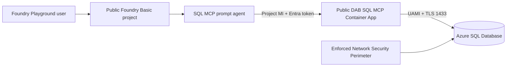

# Portal-First Public SQL MCP Setup

This runbook recreates the simplified `demo/public-evaluation` environment. It uses Azure and Microsoft Foundry portals for resource configuration and the repository scripts for artifact operations that the portals don't perform reliably: validating Bicep/DAB, building the pinned container image, applying SQL migrations, assigning an application role to a managed identity, and registering an immutable prompt-agent version.

The deployed environment is public for evaluation, contains synthetic data only, and expires on the date selected by the operator. It does not deploy Foundry IQ, Azure AI Search, a VNet, or private endpoints.

> [!IMPORTANT]
> This is a demo runbook, not the customer production runbook. It does not assume that a customer will permit public database access. Customer Azure SQL Database should use private endpoints where required, SQL Managed Instance should use its private VNet endpoint, and on-premises SQL Server should use local placement or VPN/ExpressRoute. See [SQL Backend Options](sql-backend-options.md).

## Target architecture



## Reference values

| Setting | Value |
|---|---|
| Subscription | `MCAPS-Internal-Non-Prod` (`49d5f6b0-70f2-4563-acdc-9a31d2eee119`) |
| Tenant | `16b3c013-d300-468d-ac64-7eda0820b6d3` |
| Resource group | `rg-foundry-sql-mcp-demo` |
| Foundry/Container Apps region | East US 2 |
| SQL/NSP region | Central US |
| Foundry project | `project-foundry-sql-mcp-demo` |
| Model deployment | `gpt-5.4-mini`, version `2026-03-17`, Global Standard, capacity 10 |
| SQL database | `TransferDemo`, Basic, 2 GB |
| DAB version | `2.0.9` |
| Agent | `transfer-agent-sql-mcp-demo` |

The split regions are deliberate. This subscription rejects new Azure SQL logical servers in East US 2, while Central US previously had Container Apps capacity pressure.

## Required access

Use separate privileged and runtime identities. The setup operator needs enough temporary access to create resources, role assignments, an Entra application, and the SQL Entra administrator. Runtime identities must not receive `Owner`, `Contributor`, `db_owner`, `db_datareader`, or `db_datawriter`.

| Principal | Required access |
|---|---|
| Setup operator | Resource deployment and role-assignment rights in the demo subscription; permission to create/configure an Entra application |
| Agent developer | `Foundry User` on the demo project |
| Foundry project identity | `Foundry User` on the Foundry resource; `Mcp.Invoke` on the MCP Entra application |
| MCP user-assigned identity | `AcrPull` on ACR; `mcp_reader` in `TransferDemo` |
| Demo consumer | `Foundry Agent Consumer` on the agent where available |

## 1. Prepare the repository and Azure context

```powershell
git switch demo/public-evaluation
az account set --subscription 49d5f6b0-70f2-4563-acdc-9a31d2eee119
az account show --query "{user:user.name,tenant:tenantId,subscription:id}" -o table
azd auth login --check-status
```

Create or refresh the non-secret azd environment values:

```powershell
./scripts/setup-demo-environment.ps1 `
  -Location eastus2 `
  -SqlLocation centralus `
  -ExpirationDate <yyyy-mm-dd>
```

The script records the signed-in user's Entra object ID and UPN plus the direct and Azure-routed client IPs needed by the SQL perimeter profile.

## 2. Create the resource group and monitoring

In **Azure portal > Resource groups > Create**:

1. Select subscription `MCAPS-Internal-Non-Prod`.
2. Name the group `rg-foundry-sql-mcp-demo`.
3. Select **East US 2**.
4. Add tags: `application=foundry-sql-mcp`, `purpose=public-evaluation`, `dataClassification=synthetic`, and the approved `expirationDate`.

In that resource group:

1. Create a **Log Analytics workspace** in East US 2 with 30-day retention.
2. Create **Application Insights** in East US 2, workspace-based, connected to that workspace.
3. Keep public ingestion and query enabled for this disposable demo.

The deployed reference names are `law-sql-mcp-demo-btqgzq` and `appi-sql-mcp-demo-btqgzq`.

## 3. Create the MCP identity and container registry

In **Azure portal > Managed Identities > Create**:

1. Create a user-assigned identity in East US 2.
2. Use name `id-mcp-foundry-sql-mcp-demo`.
3. Record both its **Client ID** and **Object (principal) ID**. SQL direct-SID user creation uses the client ID; Azure RBAC uses the principal ID.

In **Azure portal > Container registries > Create**:

1. Create a **Basic** registry in East US 2, such as `acrsqlmcpdemobtqgzq`.
2. Keep public network access enabled and the admin user disabled.
3. Open **Access control (IAM) > Add role assignment**.
4. Assign `AcrPull` to `id-mcp-foundry-sql-mcp-demo` at registry scope.

Do not grant the MCP identity `Contributor` on the registry or resource group.

## 4. Create the public Container Apps environment

In **Azure portal > Container Apps Environments > Create**:

1. Select `rg-foundry-sql-mcp-demo` and East US 2.
2. Use a public, non-VNet-integrated environment such as `cae-sql-mcp-demo-btqgzq`.
3. Connect it to the demo Log Analytics workspace.
4. Do not create a workload Container App yet; its image and SQL authorization are prepared in later steps.

## 5. Create the Foundry resource, project, and model

In **Azure portal > Microsoft Foundry > Create**:

1. Create an AI Services/Foundry resource in East US 2 using **Basic agent setup**.
2. Enable the system-assigned managed identity.
3. Keep public network access enabled and local/key authentication disabled.
4. Create project `project-foundry-sql-mcp-demo` with its system-assigned managed identity enabled.
5. Do not configure Standard Agent Setup dependencies, VNet injection, private endpoints, Storage, Cosmos DB, or Search for this demo.

In **Microsoft Foundry portal > Models + endpoints**:

1. Deploy `gpt-5.4-mini`.
2. Pin version `2026-03-17`.
3. Select **Global Standard** and capacity `10`.
4. Name the deployment `gpt-5.4-mini`.

In **Azure portal > Foundry resource > Access control (IAM)**:

1. Assign `Foundry User` to the project system-assigned identity at the Foundry-resource scope.
2. Assign the setup developer `Foundry User` at project scope.

Record the project identity's principal ID. The deployed reference project identity is `03b96314-4cf2-4051-9910-ce2cb90bf976`.

## 6. Create Entra-only Azure SQL Database

In **Azure portal > Azure SQL > Create > SQL database**:

1. Select `rg-foundry-sql-mcp-demo` and create a new logical server in **Central US**.
2. Name the database `TransferDemo`.
3. Under **Compute + storage**, select **Basic**, 5 DTUs, with a 2-GB maximum.
4. Under **Authentication**, select **Microsoft Entra-only authentication**.
5. Set the signed-in deployment user or an approved Entra group as server administrator.
6. Do not configure a SQL administrator login or password.
7. Set minimum TLS to `1.2`.
8. Create the database with public network access disabled initially. The NSP association supplies the approved data-plane path in the next step.

The deployed logical server is `sqlsqlmcpdemog64t67.database.windows.net`.

## 7. Protect SQL with Network Security Perimeter

The subscription has management-group policy `AzureSQL_PublicNetwork_Modify`, which disables ordinary SQL public access. Do not bypass it with an old API version or broad SQL firewall rule.

In **Azure portal > Network Security Perimeters > Create**:

1. Create `nsp-sql-mcp-demo-<suffix>` in Central US.
2. Create profile `sql-mcp-demo`.
3. Add inbound rule `allow-demo-subscription` with source type **Subscriptions** and subscription `49d5f6b0-70f2-4563-acdc-9a31d2eee119`.
4. Add inbound rule `allow-demo-clients` with only the operator CIDR `/32` addresses recorded by `setup-demo-environment.ps1` as `DEMO_CLIENT_IP` and `DEMO_AZURE_CLIENT_IP`.
5. Associate the Azure SQL logical server with profile `sql-mcp-demo`.
6. Change the association from learning/audit to **Enforced**.
7. Set the SQL server's public network mode to **Secured by perimeter**.
8. Add a diagnostic setting that sends `allLogs` to the demo Log Analytics workspace.

Validate in the SQL server's **Networking** blade that no SQL firewall rules exist. The subscription rule is an evaluation-only accommodation for non-VNet Container Apps egress; production SQL MI uses private networking instead.

Azure portal Query Editor and corporate-routed SSMS/sqlcmd traffic can use backend TDS addresses that differ from `ipify` and the ARM token IP. After one denied connection attempt, wait for NSP diagnostics to ingest and reconcile only the observed `/32`s:

```powershell
./scripts/update-demo-sql-client-ips.ps1 -LookbackHours 2 -Provision
```

The helper stores the additional addresses in `DEMO_ADDITIONAL_CLIENT_IPS`, so later `azd provision` runs preserve them. Re-run it if the portal or corporate egress pool changes. If logs prove that addresses rotate within one small contiguous range, replace its accumulated `/32`s with the narrowest observed CIDR, such as `/24`; do not use `0.0.0.0/0`.

## 8. Configure the MCP Entra application

In **Microsoft Entra admin center > App registrations > New registration**:

1. Create a single-tenant application named `foundry-sql-mcp-demo-api`.
2. Under **Expose an API**, set the Application ID URI to `api://<application-client-id>`.
3. Under **App roles**, create an application role:
   - Display name: `Invoke SQL MCP`
   - Allowed member types: **Applications**
   - Value: `Mcp.Invoke`
   - Enabled: Yes
4. Open the corresponding **Enterprise application > Properties** and set **Assignment required?** to Yes.

The portal does not reliably assign an application role to a managed identity. Use the repository script to reconcile the app, enforce assignment-required, assign `Mcp.Invoke` to the Foundry project identity, and store only non-secret IDs in azd:

```powershell
$values = azd env get-values --output json | ConvertFrom-Json
./scripts/setup-demo-entra.ps1 `
  -ProjectPrincipalId $values.AZURE_AI_PROJECT_PRINCIPAL_ID
$values = azd env get-values --output json | ConvertFrom-Json
```

Keep these two audience forms distinct:

- Foundry RemoteTool connection audience: `api://<application-client-id>`.
- DAB expected JWT `aud` claim: the bare `<application-client-id>` GUID.

Foundry sends a tenant-v2 token containing `Mcp.Invoke`. The project connection must explicitly enable use of the project managed identity.

## 9. Build the pinned DAB image

The portal does not turn repository source into the validated DAB image. Build it through ACR Tasks:

```powershell
./scripts/build-demo-mcp.ps1 `
  -RegistryName $values.AZURE_CONTAINER_REGISTRY_NAME `
  -McpApplicationId $values.MCP_AUTH_APP_ID
```

The build:

- Pins `mcr.microsoft.com/azure-databases/data-api-builder:2.0.9`.
- Replaces the committed placeholder with the bare MCP application client ID.
- Tags the image with Git commit and generated-config hash.
- Stores the resulting image URI in `MCP_CONTAINER_IMAGE`.

The currently validated image is `acrsqlmcpdemobtqgzq.azurecr.io/sql-mcp:2.0.9-0d4a93e-4b2945a8`, digest `sha256:61923e5183f2f46772ade50e2f2ea108852e1e81271cdf309e516bf9ac4b3af0`.

## 10. Deploy the SQL contract and identity

Install modern sqlcmd once:

```powershell
winget install --id Microsoft.Sqlcmd
```

Apply the idempotent schema, deterministic synthetic data, approved views/procedures, and least-privilege SQL grants:

```powershell
$values = azd env get-values --output json | ConvertFrom-Json
./scripts/deploy-demo-database.ps1 `
  -Server "$($values.AZURE_SQL_SERVER_FQDN),1433" `
  -DatabaseName $values.AZURE_SQL_DATABASE_NAME `
  -McpIdentityName $values.AZURE_MCP_IDENTITY_NAME `
  -McpIdentityClientId $values.AZURE_MCP_IDENTITY_CLIENT_ID
```

Azure SQL Database creates the MCP contained user from the UAMI client-ID SID and `TYPE = E`; it does not need SQL MI's Directory Readers prerequisite. Confirm in the database that:

- `mcp_reader` has `SELECT` only on four approved views.
- `mcp_reader` has `EXECUTE` only on three approved stored procedures.
- The MCP identity belongs only to `mcp_reader`.
- Raw tables and writes remain denied.

## 11. Create the SQL MCP Container App

In **Azure portal > Container Apps > Create**:

1. Select the existing public environment in East US 2.
2. Name the app `app-sql-mcp-demo-<suffix>`.
3. Assign user identity `id-mcp-foundry-sql-mcp-demo`.
4. Select the ACR image produced in the previous step.
5. Configure ACR authentication with the same user-assigned identity.
6. Set CPU to `0.5`, memory to `1 GiB`, minimum replicas to `1`, and maximum replicas to `1`.
7. Enable external HTTPS ingress on target port `5000`; do not allow insecure HTTP.
8. Add environment variable `DAB_ENVIRONMENT=Production`.
9. Add non-secret environment variable `DATABASE_CONNECTION_STRING`:

```text
Server=tcp:<sql-server>.database.windows.net,1433;Initial Catalog=TransferDemo;Authentication=Active Directory Managed Identity;User Id=<mcp-uami-client-id>;Encrypt=True;TrustServerCertificate=False;Connection Timeout=30;
```

10. Deploy and wait for the revision to become healthy.

Do not add SQL passwords, registry passwords, or secrets to the Container App.

## 12. Create the Foundry MCP project connection

In **Microsoft Foundry portal > project > Build > Tools**:

1. Select **Connect a tool > Custom > MCP**. Portal wording can vary while the preview evolves.
2. Name the connection `sql-mcp-demo`.
3. Set the endpoint to `https://<container-app-fqdn>/mcp`.
4. Select **Microsoft Entra - project managed identity** authentication.
5. Set audience to `api://<mcp-application-client-id>`.
6. Share the connection with the project if prompted.

After creation, inspect the connection JSON or Azure resource JSON and confirm:

```text
category: RemoteTool
authType: ProjectManagedIdentity
useWorkspaceManagedIdentity: true
audience: api://<mcp-application-client-id>
target: https://<container-app-fqdn>/mcp
```

If the portal doesn't expose `useWorkspaceManagedIdentity`, run `azd provision --no-prompt` to reconcile the exact Bicep contract.

## 13. Register the prompt agent

The project-native prompt agent is versioned through the Foundry v2 SDK so its immutable definition is reproducible:

```powershell
./scripts/register-demo-agent.ps1
./scripts/test-demo-agent.ps1
```

The agent uses `gpt-5.4-mini`, connection `sql-mcp-demo`, and only these tools:

- `describe_entities`
- `read_records`
- `aggregate_records`
- `get_transfer_summary_by_client`
- `get_open_risk_alerts`
- `get_advisor_pipeline`

The three report intents are routed to their custom tools. All tools are read-only, so approval is set to `never`. The currently validated agent is `transfer-agent-sql-mcp-demo:2`.

## 14. Validate in the portals

In **Azure portal**:

1. Confirm Azure SQL Database is `Online`, Entra-only, TLS 1.2, and `SecuredByPerimeter`.
2. Confirm the NSP association is `Enforced` and has only the subscription and operator rules.
3. Confirm the MCP UAMI has only `AcrPull` in Azure RBAC.
4. Confirm the Container App has one healthy replica and the expected commit-tagged image.
5. Confirm no temporary diagnostic Container App or image repository remains.

In **Microsoft Entra admin center**:

1. Confirm the MCP enterprise application requires assignment.
2. Confirm the Foundry project identity has only the `Mcp.Invoke` app-role assignment on that application.

In **Microsoft Foundry portal > Build > Agents**:

1. Select `transfer-agent-sql-mcp-demo`, latest version.
2. Open **Playground**.
3. Run:

```text
Return the transfer summary for CLIENT-001.
Show open High severity risk alerts.
Summarize the transfer pipeline for advisor ADV-MIL-01.
```

Each response must contain grounded synthetic SQL rows. Anonymous MCP/data calls must fail, wrong-audience tokens must fail, and raw tables/write operations must remain unavailable.

## 15. Cleanup

The supported cleanup path removes the disposable resource group and MCP Entra application without touching the private SQL MI environment:

```powershell
./scripts/cleanup-demo.ps1 -ConfirmCleanup
```

After cleanup, verify that `rg-foundry-sql-mcp-demo` and `foundry-sql-mcp-demo-api` no longer exist. Do not delete or modify `rg-foundry-sql-mcp-dev-centralus`.

## Repository-supported path

The portal steps explain every resource and security decision. For repeatable recreation, Bicep remains authoritative:

```powershell
./scripts/test-demo.ps1
azd provision --preview --no-prompt
azd provision --no-prompt
```

See [SQL MCP Public Demo Guide](demo-guide.md) for the concise operator sequence and [SQL Backend Options](sql-backend-options.md) for customer SQL MI and on-premises SQL Server requirements.