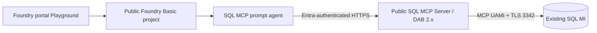

# Public Evaluation Demo Roadmap

## Status

**Approved for implementation.** Code generation and local validation are in progress. Demo deployment and changes to the existing SQL MI require a separate confirmation after validation.

## Implementation Status

| Milestone | Status |
|---|---|
| M0 approval and preflight | Complete |
| M1 public demo infrastructure | Public bootstrap deployed successfully |
| M2 synthetic SQL data contract | Implemented; live execution pending |
| M3 SQL authorization | Implemented; live execution pending |
| M4 SQL MCP Server | Implemented; initial pinned image built; Container App deployment pending SQL |
| M5 SQL MCP prompt agent | Implemented and SDK-validated; registration pending |
| M6 demonstration package | Implemented; live Playground proof pending |

Validation selected East US 2, confirmed 2,580K TPM of available `gpt-5.4-mini` GlobalStandard quota, produced a create-only azd preview, and produced an ARM what-if with 13 creates and no updates or deletes.

Live deployment created the public Foundry project/model, ACR, public Container Apps environment, UAMI, and monitoring. Entra `Mcp.Invoke` configuration succeeded. SQL MI startup is the active gate; the public listener and NSG exception remain disabled until startup completes.

## Purpose

Produce a working, non-production demonstration of `transfer-agent-sql-mcp-demo`, a Microsoft Foundry prompt agent that performs deterministic SQL MCP lookups, filters, aggregates, and reports over synthetic Azure SQL Managed Instance data.

This branch intentionally removes private networking from the Foundry and MCP paths so the agent can be created and tested from the public Microsoft Foundry portal Playground. It preserves Microsoft Entra authentication, managed identity, synthetic data, named-object SQL grants, and read-only tools.

Foundry IQ, Azure AI Search knowledge sources, indexes/indexers, knowledge bases, embedding models, and an IQ comparison agent are explicitly out of scope for this branch.

This profile is for evaluation only. It is not the production security target documented on `main`.

## Branch Strategy

| Branch | Purpose |
|---|---|
| `main` | Secure private reference architecture and normative production direction |
| `fix/private-network-idempotency` | Preserved SQL MI Network Intent Policy/idempotency investigation |
| `demo/public-evaluation` | Public, minimal-networking demonstration implementation |

Do not merge the demo's public-network defaults into `main`. Reusable schema, seed, DAB, agent, and evaluation code can be promoted later through a reviewed pull request with environment-specific infrastructure separated.

## Current Baseline

Verified on July 30, 2026:

- Existing resource group: `rg-foundry-sql-mcp-dev-centralus`.
- SQL MI `sqlmi-sqlmcp-d3q5zq` exists in Central US with 4 vCores and is currently `Stopped`.
- SQL MI public data endpoint is disabled.
- Foundry account/project, `gpt-5.4-mini`, and project capability host succeeded.
- Existing Foundry public network access is disabled, so public Playground access returns `403 Public access is disabled`.
- Existing Container Apps environment is `Failed`.
- No SQL schema, seed data, database users/roles, DAB configuration, MCP container, or prompt agent exists.
- No agent resources are registered in the project.

## Demo Architecture



### Deliberately retained controls

- Microsoft Entra authentication for Foundry and SQL MCP.
- Managed identity from SQL MCP Server to SQL MI.
- SQL Entra-only administration.
- Synthetic data only.
- `mcp_reader` named-object grants.
- Read-only DAB operations and explicit MCP tool allowlist.
- TLS for all data-plane calls.
- Foundry Agent Consumer for demo users.
- Logging and a deterministic cleanup path.

### Deliberately removed isolation

- Foundry VNet injection.
- Foundry private endpoint and private DNS dependency.
- BYO private Storage/Cosmos/Search Standard Setup.
- Private Container Apps environment and MCP subnet.
- MCP private endpoint/DNS.
- Azure Monitor Private Link Scope for the demo resources.

### Constraint that cannot be removed

Azure SQL Managed Instance requires its delegated VNet/subnet. The demo will reuse the existing SQL MI and enable its public data endpoint on TCP `3342`. A public Container Apps environment without VNet/NAT has outbound IPs that can change, so the evaluation profile allows the `AzureCloud` service tag to reach TCP `3342`. This is intentionally broad network reachability; Entra managed identity and named-object SQL grants remain the authorization boundary.

## Resource Strategy

Create new public demo resources rather than opening the existing private Foundry project:

| Resource | Planned name/pattern | Notes |
|---|---|---|
| azd environment | `foundry-sql-mcp-demo` | Separate deployment state |
| Resource group | `rg-foundry-sql-mcp-demo` | All disposable demo resources |
| Region | `eastus2` | Avoids prior Central US ACA capacity issue; SQL MI remains in Central US |
| Foundry account/project | Deterministic demo suffix | Public Basic Setup; no capability host or VNet injection |
| Chat model | `gpt-5.4-mini` | Pin tested version/SKU after quota validation |
| Azure Container Registry | Demo suffix | Public network; MCP UAMI gets `AcrPull` only |
| Container Apps environment | Demo suffix | Public consumption/workload profile; no VNet integration |
| SQL MCP Container App | Demo suffix | Entra-authenticated public HTTPS `/mcp` endpoint |
| App Insights/Log Analytics | Demo suffix | Public ingestion/query for demo simplicity |

The existing SQL MI remains in `rg-foundry-sql-mcp-dev-centralus`. Cross-resource permissions and SQL grants will target its database explicitly.

## Security Exception Register

| Exception | Demo rationale | Compensating control | Production disposition |
|---|---|---|---|
| Public Foundry endpoint | Browser-based Playground access | Entra RBAC; no keys; synthetic data | Replace with private endpoint/VPN or approved access path |
| Public MCP endpoint | Foundry Basic project must reach remote MCP | Entra JWT validation, app-role restriction, read-only tools, rate limits where available | Move to private MCP through Standard Setup |
| SQL MI public endpoint | Public ACA needs SQL reachability | TLS 3342, `AzureCloud` service tag, MCP managed identity, named-object grants | Disable and remove the rule after demo; use private MCP in production |
| Public ACR/monitoring | Faster demo deployment | Managed identity pull; no secrets in images/config | Private endpoints in production |

No exception permits SQL passwords, shared database credentials, raw-table exposure, unrestricted SQL, write tools, or production/customer data.

## Milestones

### M0: Approval and preflight

Deliverables:

- Approved roadmap and deployment plan.
- Confirmed subscription and demo resource group.
- Region selected after model quota and Container Apps availability checks.
- Cost and cleanup expectations acknowledged.
- Azure CLI and azd authenticated to tenant `16b3c013-d300-468d-ac64-7eda0820b6d3` and subscription `49d5f6b0-70f2-4563-acdc-9a31d2eee119`.

Gate:

- No Azure changes until explicit approval.

### M1: Public demo infrastructure

Implement a separate Bicep demo composition that creates:

- Public Foundry Basic account/project.
- Chat model deployment.
- Public ACR.
- Public Container Apps environment without VNet integration.
- MCP UAMI and narrow ACR role.
- Public monitoring.

Modify the existing SQL MI only to:

- Start the instance.
- Enable public data endpoint.
- Add a time-bounded `AzureCloud` TCP `3342` NSG rule because non-VNet ACA outbound IPs can change.

Gate:

- Foundry portal opens from the user's browser.
- Model invocation succeeds.
- No private endpoint, VNet injection, or capability host exists in the demo RG.

### M2: Synthetic SQL data contract

Implement idempotent SQL migrations and deterministic seed data for:

- Client, household, advisor, account, transfer, status history, document checklist, risk alert, and interaction-note tables.
- Four approved views.
- Three approved stored procedures.
- Stable keys and freshness fields for repeatable reports.

Gate:

- Positive SQL assertions pass.
- Seed reruns are idempotent.
- Only synthetic records exist.

### M3: SQL authorization

Create a contained Entra user for the MCP UAMI and add it to `mcp_reader`.

Grant only named-view `SELECT` and named-procedure `EXECUTE` permissions.

Gate:

- The MCP identity fails raw-table reads and writes.
- The MCP identity doesn't belong to `db_datareader`, `db_datawriter`, or `db_owner`.

### M4: SQL MCP Server

Implement and deploy:

- Pinned DAB 2.x configuration.
- Approved views and procedures only.
- Entra JWT issuer/audience validation for inbound MCP calls.
- UAMI connection to the SQL MI public FQDN on TCP `3342`.
- Read-only DAB operations and stored-procedure custom tools.
- Health probes, telemetry, and MCP Inspector smoke tests.

Gate:

- Anonymous, wrong-tenant, and wrong-audience calls fail.
- Approved reads/reports succeed.
- Raw tables, writes, arbitrary SQL, and unapproved procedures are unavailable.

### M5: SQL MCP prompt agent

Register `transfer-agent-sql-mcp-demo` with:

- `gpt-5.4-mini`.
- Shared baseline instructions.
- Public Entra-authenticated MCP project connection.
- Explicit approved-tool list.
- `require_approval="never"` only because every tool is read-only.

Gate:

- Agent version appears in Foundry portal.
- Playground invocation succeeds from the public browser.
- Deterministic demo prompts match direct SQL expectations.

This milestone is the minimum viable demonstration.

### M6: Demonstration package

Deliver:

- One-command validation script.
- Demo operator guide and exact portal links.
- Demo question set and expected outcomes.
- Architecture/security disclaimer slide or Markdown brief.
- Cleanup command and post-demo verification.

Suggested demonstration sequence:

1. Show the SQL MCP agent in Foundry portal.
2. Ask an exact client/transfer lookup question.
3. Ask an aggregate/status question.
4. Ask for the advisor pipeline report.
5. Show identity assignments, DAB allowlist, and failed raw-table/write tests.
6. Explain which public exceptions are demo-only and how `main` restores private isolation.

## Implementation Order

```text
M0 -> M1 -> M2 -> M3 -> M4 -> M5 -> M6 -> demo-ready
```

No Foundry IQ work is included in this branch.

## Validation Strategy

Every milestone must add an executable check. At minimum:

- Bicep compile and ARM what-if.
- Credential and private-key scan.
- SQL migration and authorization tests.
- DAB config parse and container health test.
- MCP `tools/list` and approved `tools/call` tests.
- Negative MCP auth and SQL permission tests.
- Agent single-turn smoke tests.
- Portal visibility check for the SQL MCP agent version.

Do not claim a milestone works until its gate passes.

## Cost Controls

- Reuse the existing SQL MI rather than create another instance.
- Start SQL MI only for implementation and demonstration windows; stop it afterward.
- Use minimal non-production ACR, ACA, and monitoring SKUs.
- Use low model deployment capacity consistent with quota and demo traffic.
- Tag every demo resource with `purpose=public-evaluation` and an expiration date.
- Delete the demo RG after the evaluation period.

## Cleanup and Rollback

Demo cleanup must:

1. Delete `rg-foundry-sql-mcp-demo` through azd/Bicep lifecycle tooling.
2. Remove demo SQL contained users and role memberships.
3. Remove demo-specific SQL MI NSG rules.
4. Disable the SQL MI public endpoint.
5. Stop SQL MI if no other work needs it.
6. Verify the existing private Foundry RG remains unchanged except for explicitly approved SQL MI demo toggles.

Rollback must not delete the existing Central US SQL MI, secure Foundry project, VNet, private endpoints, or private DNS zones.

## Definition of Demo-Ready

The demonstration is ready when:

- The public Foundry project is reachable in the user's browser.
- `transfer-agent-sql-mcp-demo` is visible and usable in Playground.
- At least three deterministic questions return correct synthetic results.
- Negative auth, raw-table, and write tests pass.
- The README/demo guide states that the environment is public and non-production.